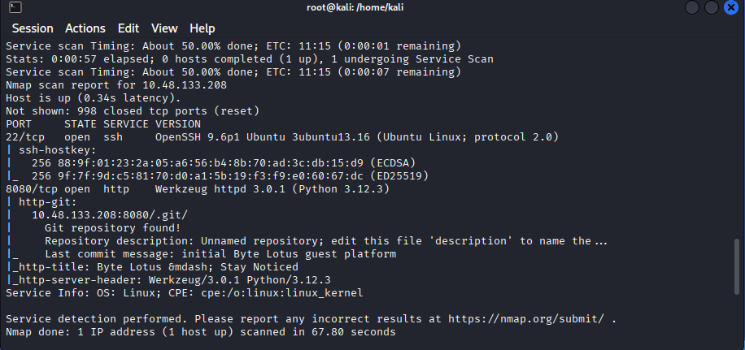
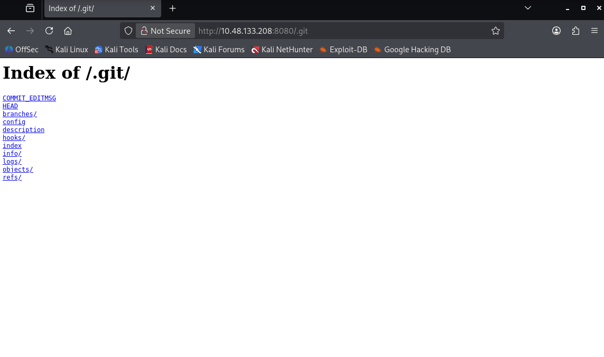

# Challenge 2: Room 404

## Overview

| Field | Value |
|---|---|
| **Platform** | TryHackMe |
| **Event** | Hacker Holidays 2026 |
| **Category** | Web Security |
| **Difficulty** | Very Easy |
| **Vulnerability Type** | Exposed Git Repository |

---

## Objective

Extract the website's source code and locate the flag.

---

## Challenge Analysis

Reconnaissance began with an Nmap scan to enumerate available services on the target:

```
nmap -sC -sV <Target-IP>
```

**Results:**
```
22/tcp    OpenSSH
8080/tcp  HTTP (Werkzeug)
```

The scan revealed a web service running on port 8080, and further inspection uncovered a publicly accessible directory:

```
http://<Target-IP>:8080/.git/
```

Nmap also disclosed a commit message, confirming that a Git repository was publicly exposed.



---

## Root Cause

The website had been deployed with its `.git` directory left in place, without restricting web server access to it. This directory contains a full Git database, which can include:

- Source code
- Commit history
- Deleted files
- Accidentally committed keys or secrets
- Sensitive data never intended for publication

This class of vulnerability is known as an **Exposed Git Repository**.

---

## Exploitation Steps

### 1. Reconnaissance

```
nmap -sC -sV <Target-IP>
```

This revealed the exposed path:
```
http://<Target-IP>:8080/.git/
```


### 2. Dumping the repository

The `git-dumper` tool was used to reconstruct the full repository:

```
git-dumper http://<Target-IP>:8080/.git dumped
```

The tool successfully downloaded all Git objects and rebuilt the project locally.

### 3. Reviewing the extracted files

The recovered repository contained:

- `app.js`
- `index.html`
- `README.md`

### 4. Locating the flag

Opening the README file:

```
cat README.md
```

revealed the following entry:

```
Staging flag (remove before launch):
THM{*****}
```

---

## Result

**Flag obtained:**
```
THM{*****}
```

---

## Security Impact

An exposed Git repository allows an attacker to:

- Obtain the complete application source code
- Review the full commit history
- Recover deleted files
- Discover passwords, API keys, or credentials stored in the project
- Analyze the application further to identify additional vulnerabilities

---

## Mitigation

- Block web server access to the `.git` directory.
- Never deploy development files (including `.git`) to production environments.
- Use deployment pipelines that explicitly exclude Git metadata.
- Review repositories prior to deployment to ensure no sensitive data is included.
- Store secrets using dedicated mechanisms such as environment variables or secret-management services.

---

## Lessons Learned

- Every penetration test should begin with a reconnaissance phase — tools like Nmap can reveal critical information without any complex exploitation.
- An exposed Git repository is a common web application mistake that can lead to full source code disclosure.
- Even seemingly unimportant files, such as `README.md`, may contain sensitive information mistakenly left in production.
- Specialized tools like `git-dumper` greatly simplify repository recovery and analysis once this class of vulnerability is discovered.
