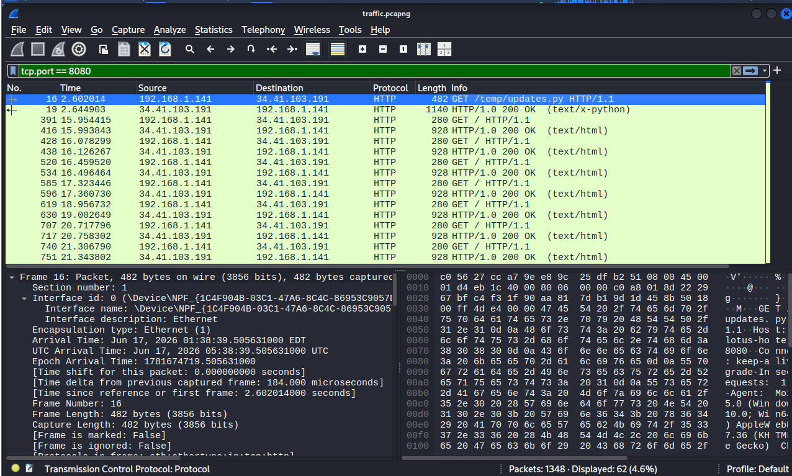
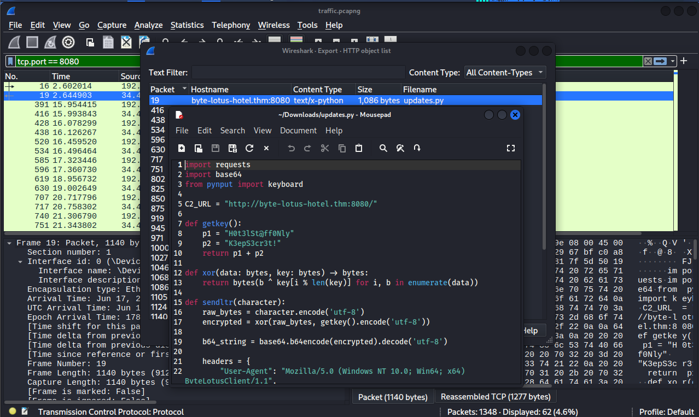
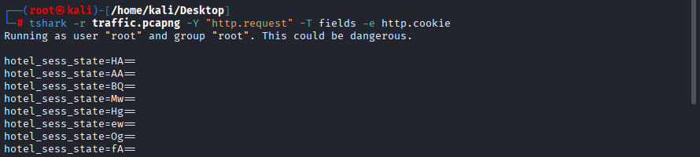
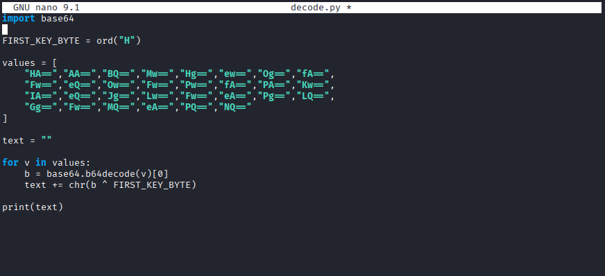

# Challenge 4: Packed Light

## Overview

| Field | Value |
|---|---|
| **Platform** | TryHackMe |
| **Event** | Hacker Holidays 2026 |
| **Category** | Network Forensics |
| **Difficulty** | Easy |
| **Vulnerability Type** | PCAP Analysis / Data Exfiltration / Malware Analysis |

---

## Objective

Analyze a network capture (PCAP) file to identify a covert communication channel, reassemble the exfiltrated data, and decode it to obtain the flag.

---

## Challenge Analysis

While reading the challenge description, several important indicators stood out:

- Only a PCAP file was provided for analysis.
- A reference to repeated connections to port `8080`.
- A hint that data was not being sent in a conventional manner, but hidden inside requests that appeared normal.
- A mention that the Request Headers looked suspicious, suggesting the data was concealed inside HTTP headers rather than in the request body.

Based on these indicators, the first step was to analyze the PCAP file using **Wireshark** and **TShark**.

After reviewing the network traffic, repeated HTTP requests were observed to:

```
http://byte-lotus-hotel.thm:8080
```



A Python file was also found being downloaded from the server:

```
/temp/updates.py
```

Analysis of the file revealed it to be a **keylogger** that monitors keystrokes and sends them to the server.



Reviewing the code further showed that the data was not sent inside the request body or the URL, but instead placed inside the following HTTP header:

```
Cookie: hotel_sess_state=<Base64 Data>
```

This confirmed that the covert channel in use was the **HTTP Cookie header**.

### Tools Used

- Wireshark
- TShark
- Python 3
- Nano

### Rationale for the Next Step

After understanding how the program operated, it became clear that the task was to extract all `hotel_sess_state` values from the network file, then decode them using the same algorithm found inside the program.

---

## Root Cause

The vulnerability lies in the use of a **covert channel** to hide stolen data inside the HTTP `Cookie` header.

HTTP itself and cookies are not inherently vulnerabilities; however, using them to conceal sensitive data allows malware to exfiltrate information in a way that is difficult to detect within normal network traffic.

In this challenge, the malware performed the following:

1. Logged keystrokes.
2. Encrypted each character using **XOR**.
3. Converted the result to **Base64**.
4. Sent the value inside a cookie named:
   ```
   hotel_sess_state
   ```

As a result, the requests appeared to be ordinary HTTP traffic while actually carrying stolen data.

---

## Discovery Process

The exfiltration method was discovered after analyzing the `updates.py` file, which contained the following code:

```python
headers = {
    "Cookie": f"hotel_sess_state={b64_string}"
}
```

This confirmed that the data was being sent inside a cookie. All cookie values were then extracted using:

```
tshark -r traffic.pcapng -Y "http.request" -T fields -e http.cookie
```


The result was a series of encoded values such as:

```
hotel_sess_state=HA==
hotel_sess_state=AA==
hotel_sess_state=BQ==
...
```

Code analysis also showed that each value passed through the following stages:

```
Character
  ↓
XOR Encryption
  ↓
Base64 Encoding
  ↓
HTTP Cookie
```

This confirmed the full concealment mechanism.

---

## Exploitation Steps

### Step 1 — Analyzing the Network File

The `updates.py` file was extracted from the network capture and analyzed to understand how the malware operated.

### Step 2 — Identifying the XOR Key

Reviewing the code revealed the XOR key inside the following function:

```python
def getkey():
    return p1 + p2
```

### Step 3 — Extracting Cookie Values with TShark

```
tshark -r traffic.pcapng -Y "http.request" -T fields -e http.cookie
```

### Step 4 — Writing a Python Decoding Script



The script performed the following steps:

1. Base64 decoding.
2. XOR decryption using the encryption key.
3. Reassembling all characters in the order they were sent.

### Step 5 — Running the Script

```
python3 decode.py
```



This recovered the original message containing the flag.

---

## Result

After analyzing the network traffic and decoding the data hidden inside the cookie values, the original text containing the flag was recovered:

```
THM{*****}
```

The challenge did not involve obtaining a shell or performing privilege escalation — the objective was limited to network forensic analysis and recovery of exfiltrated data.

---

## Mitigation

To reduce the risk of this type of attack, the following measures can be applied:

- Monitor HTTP requests and detect abnormal patterns.
- Inspect HTTP header values — especially cookies — for encoded or unusual data.
- Monitor periodic, repeated connections to the same server.
- Use EDR and IDS/IPS solutions to detect keylogging malware.
- Prevent untrusted programs from accessing the keyboard or establishing outbound connections.
- Analyze network traffic to detect covert communication channels.

---

## Lessons Learned

- Learned how to analyze PCAP files using Wireshark and TShark.
- Learned how to detect data exfiltration channels hidden inside HTTP headers.
- Learned how to analyze malware source code to understand its behavior.
- Learned how to extract encoded data from network traffic.
- Learned how to use Base64 and XOR to recover original data.
- Realized that sensitive data may be hidden inside HTTP headers, not just within request bodies.

---

## References

- [Wireshark Documentation](https://www.wireshark.org/docs/wsug_html/)
- [TShark User Guide](https://www.wireshark.org/docs/man-pages/tshark.html)
- [MITRE ATT&CK – Input Capture: Keylogging (T1056.001)](https://attack.mitre.org/techniques/T1056/001/)
- [MITRE ATT&CK – Exfiltration Over Web Service (T1567)](https://attack.mitre.org/techniques/T1567/)
