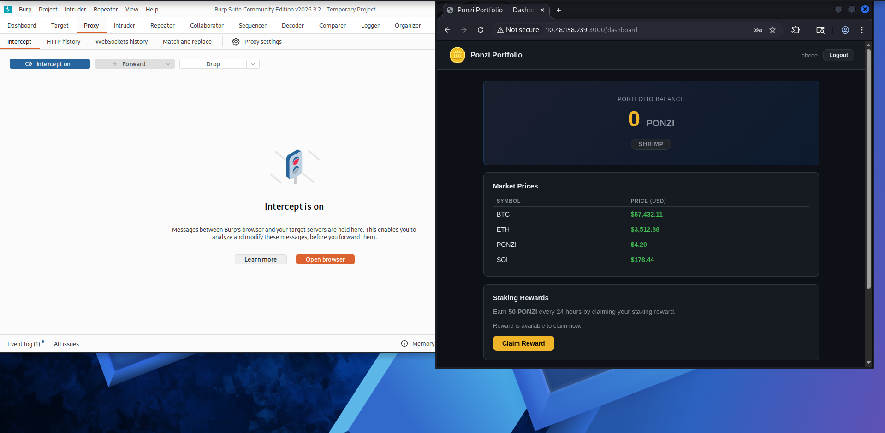
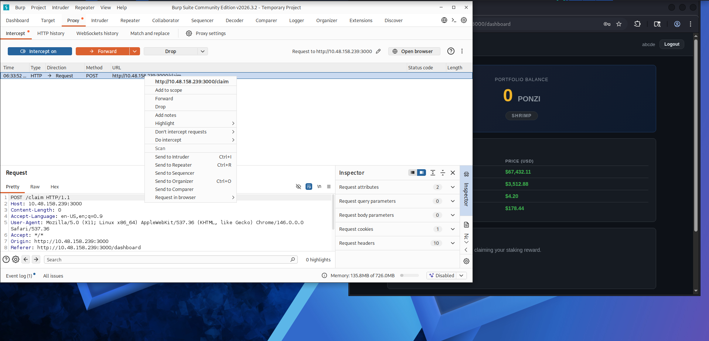
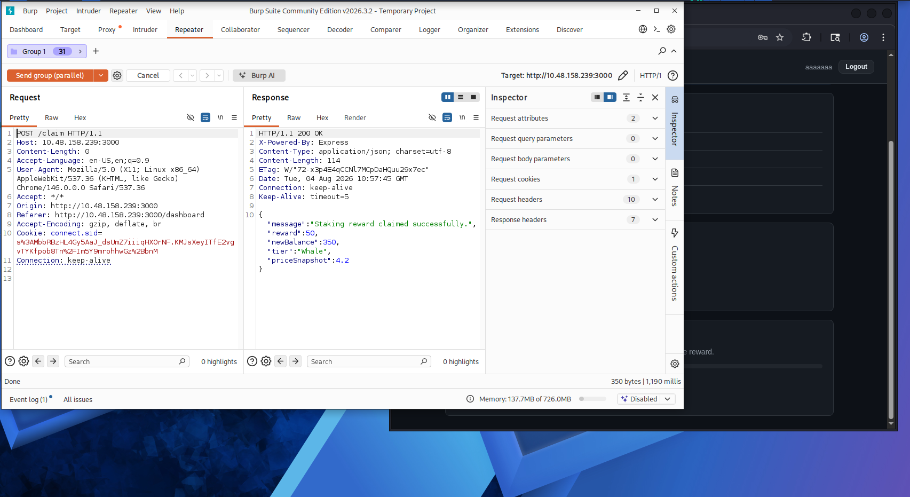
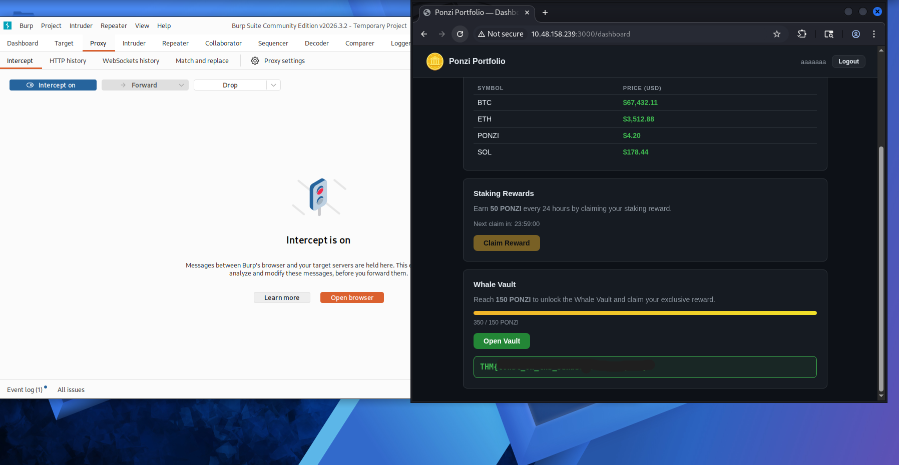

# Challenge 8: Towel on the Sunbed

## Overview

| Field | Value |
|---|---|
| Platform | TryHackMe |
| Event | Hacker Holidays 2026 |
| Challenge | Towel on the Sunbed |
| Category | Web Exploitation / Business Logic / API Abuse |
| Difficulty | Medium |
| Vulnerability Type | Race Condition (Business Logic Vulnerability) |

## Objective

Bypass the daily reward system in the Ponzi application and access the Whale Vault to obtain the flag.

### Target Goal

Exploit the Daily Reward Claim mechanism to obtain the reward multiple times within a short period, then unlock the Whale Vault and extract the flag.

---

## Reconnaissance and Analysis

### Observations

After starting the machine and accessing the application at:

```
http://MACHINE_IP:3000
```

a web application named **Ponzi — Wellness Rewards** was identified.

The application allows a user to create an account and claim a **Daily Reward**. According to the challenge description, the system is intended to allow the user to claim the reward only once every 24 hours, but a flaw exists that allows it to be claimed more than once.




The hint provided in the challenge:

> *"the clock is the only thing checking him"*

suggests that the application relies on a time check to prevent repeated claims — implying a possible flaw in the verification logic.

### Open Services

| Port | Service |
|---|---|
| 3000 | Web Application |

No other services such as SSH or FTP were needed, since the challenge relies entirely on exploiting the web application.

### Tools Used

- **Browser** — accessing the application.
- **Burp Suite** — intercepting and analyzing HTTP requests.
- **Repeater** — testing request replay.
- **Intruder / Parallel Requests** — testing simultaneous request submission.

### Rationale for the Next Step

After clicking the **Claim Reward** button, an HTTP request was observed:

```
POST /claim
```

with no data in the body:

```
Content-Length: 0
```

This indicated that the reward-claim process relied on server-side session state rather than data submitted by the client. The investigation therefore focused on testing the server's processing logic.



---

## Root Cause

### The Vulnerability

**Race Condition in Business Logic** — a condition that occurs when multiple requests are processed simultaneously before the system updates the user's internal state.

### Why It Is a Vulnerability

The application relies on the following sequence:

1. Check whether the user claimed the reward within the last 24 hours.
2. Grant the reward.
3. Update the last-claim timestamp.

If several requests arrive at the same moment, they may all pass the verification step before the update step is executed.

### How It Manifested in This Challenge

The application assumed the following flow:

```
User claims reward
        |
Check last claim time
        |
Give reward
        |
Update claim time
```

However, due to the lack of protection against concurrent requests, it was possible to send a large number of `POST /claim` requests simultaneously, resulting in the reward being granted multiple times.

---

## Discovery Process

### Identifying the Vulnerability

Several indicators pointed toward the presence of a race condition:

- The challenge narrative referenced someone who claimed the reward three times.
- A problem related to timing was implied.
- A system existed that prevents claims within a 24-hour window.

### Tests Performed

**1. Request Replay Test (Repeater)**

A `POST /claim` request was sent again after a successful initial claim. The result showed that the system correctly blocked a normal repeated claim due to the time condition.

**2. Concurrent Request Test**

Multiple copies of the request were created and sent in parallel using Burp Suite:

- Duplicating the tab multiple times.
- Grouping requests.
- Using "Send in Parallel."

### Observed Indicators

After sending the multiple requests:

- The number of rewards increased abnormally.
- The 24-hour waiting condition was bypassed.
- The Whale Vault was unlocked.

This confirmed the presence of a race condition.

---

## Exploitation Steps

### 1. Starting the Machine

The lab machine was started, giving access to:

```
http://MACHINE_IP:3000
```

### 2. Creating an Account

A new account was created within the Ponzi application.

### 3. Intercepting the Claim Request

After clicking **Claim Reward**, the request was intercepted using Burp Suite:

```
POST /claim HTTP/1.1
Host: MACHINE_IP:3000
Cookie: connect.sid=SESSION_ID
Content-Length: 0
```

### 4. Sending Requests Concurrently

Multiple copies of the same request were sent simultaneously:

- Opening Repeater.
- Creating a group.
- Duplicating the request approximately 30 times.
- Using **Send in parallel**.



### 5. Bypassing the Protection Logic

Because the requests were executed at the same moment, the server processed several of them before updating the last-claim timestamp.

**Result:**

```
Reward claimed multiple times
```

A large number of points was obtained as a result.

### 6. Unlocking the Whale Vault

After exceeding the required threshold, the following message appeared:

```
Whale Vault Unlocked
```

The flag was found inside.



---

## Result

### What Happened After Exploitation?

After sending the concurrent requests:

- The 24-hour restriction was bypassed.
- A large number of rewards was obtained.
- The Whale Vault was unlocked.

**Flag obtained?** Yes — extracted from inside the Whale Vault.

**Shell obtained?** No — there was no exploitation of the operating system or shell access involved.

**Privilege escalation achieved?** No — the vulnerability existed entirely within the application's business logic.

---

## Mitigation / Remediation

**1. Use Atomic Transactions**
The following operations should occur within a single, indivisible transaction:
- Checking claim eligibility.
- Updating the last-claim timestamp.
- Granting the reward.

**2. Use Database Locking**
Prevent more than one claim operation from executing simultaneously for the same user, using mechanisms such as:
- Row locking.
- Transaction isolation.

**3. Apply Server-Side Validation**
Do not rely on time or data supplied by the client. The server alone should be responsible for:
- Calculating elapsed time.
- Determining claim eligibility.

**4. Add Rate Limiting**
Restrict the number of requests allowed within a short time window, e.g.:
```
Maximum 1 claim request per minute
```

**5. Prevent Improper Concurrent Processing**
Sensitive functions should be tested against:
- Race conditions.
- Concurrent requests.
- Duplicate transactions.

---

## Lessons Learned

- Learned that some vulnerabilities do not depend on malformed input, but on the order in which operations are executed.
- Learned how to test web applications for race conditions.
- Learned how to use Burp Suite to send multiple requests in parallel.
- Understood the importance of protecting sensitive functions such as:
  - Rewards.
  - Financial transfers.
  - Coupons.
  - Purchase operations.
- Realized that checking time alone is not sufficient to prevent abuse if execution is not handled safely.
- Learned that a simple API endpoint such as `POST /claim` can conceal a serious logic flaw.

---

## References

- [PortSwigger Web Security Academy — Race Conditions](https://portswigger.net/web-security/race-conditions)
- [OWASP Web Security Testing Guide — Business Logic Testing](https://owasp.org/www-project-web-security-testing-guide/v42/4-Web_Application_Security_Testing/10-Business_Logic_Testing/00-Introduction_to_Business_Logic)
