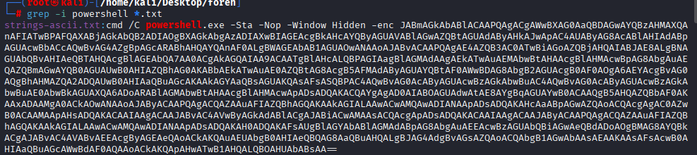
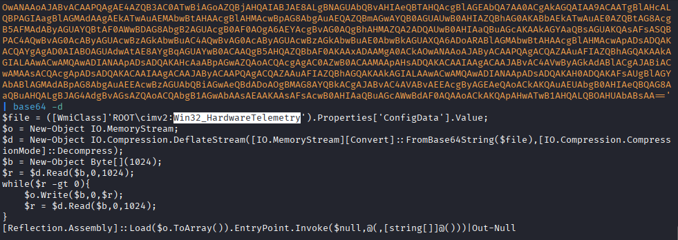
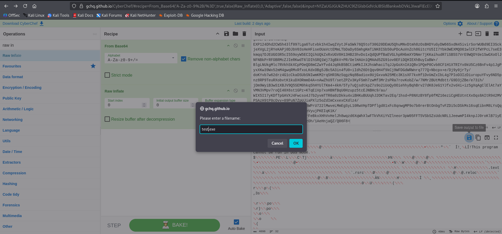
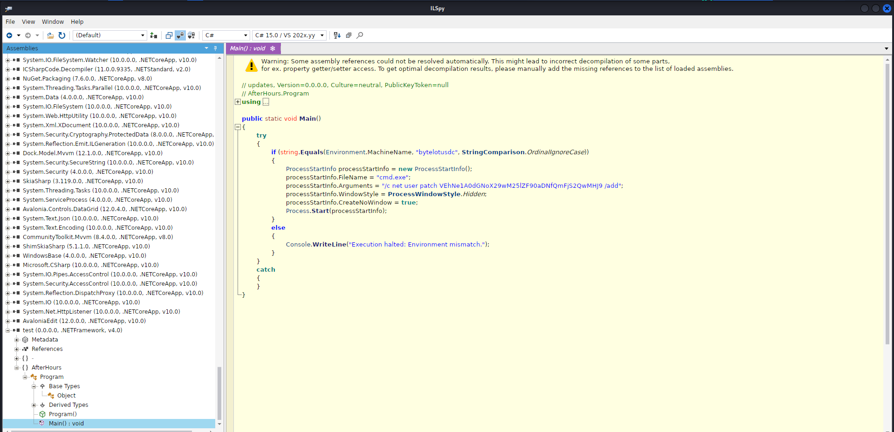

# Challenge 12: After Hours

## 1. Challenge Information

| Field | Value |
|---|---|
| **Platform** | TryHackMe |
| **Event** | Hacker Holidays 2026 |
| **Category** | Forensics |
| **Difficulty** | Medium |
| **Vulnerability Type** | Fileless WMI Repository Persistence / Reflective .NET Assembly Loading |

**Objective:**
Analyze the provided Windows forensic artifacts (WMI CIM repository files) to locate a hidden persistence mechanism that doesn't show up in Startup, Scheduled Tasks, or Registry Run keys, extract the embedded malicious payload, and recover the flag.

---

## 2. Understanding the Challenge (Recon / Analysis)

### What did I notice?
The Concierge Briefing explicitly stated that back-office machines were being accessed during off-hours, and that **nothing obvious showed up in Startup, Scheduled Tasks, or the registry Run keys** — a strong hint that the persistence mechanism used was something unconventional, not covered by standard autoruns-style tools. An in-room social post from `@0xMia` reinforced this, warning that "the usual autoruns/persistence tools straight up don't catch this one," and that the raw data would need to be dug through by hand.

### What services / artifacts were provided?
The room provided a set of files typical of a Windows **WMI CIM repository**:
```
attachments-1784136288483.zip
INDEX.BTR
MAPPING1.MAP
MAPPING2.MAP
MAPPING3.MAP
OBJECTS.DATA
```
These are the core files that make up the WMI repository on a Windows system (normally found under `C:\Windows\System32\wbem\Repository`), which stores WMI classes, namespaces, and instance data — including any custom classes an attacker may have created to store data or payloads.

### What tools did I use?
- `strings` (both ASCII and UTF-16LE modes) to extract readable text from the binary `OBJECTS.DATA` repository file.
- `grep` to search the extracted strings for relevant keywords.
- **CyberChef** to decode Base64 and decompress (Raw Inflate) the extracted payload.
- **ILSpy** to decompile the recovered .NET executable and inspect its source.
- `file` to identify the recovered binary's type.

### Why did I move to the next step?
Since standard persistence-hunting tools wouldn't catch this, the logical next step was to treat `OBJECTS.DATA` as raw binary data and pull every readable string out of it, in both ASCII and UTF-16LE (the encoding Windows commonly uses for internal strings, and the encoding PowerShell's `-enc` parameter expects), then search for anything execution-related.

---

## 3. Root Cause

The root cause here isn't a classic "vulnerability" in an application, but a **fileless persistence technique**: the attacker embedded a malicious **.NET payload directly inside the WMI repository**, disguised as configuration data for a custom WMI class (`Win32_HardwareTelemetry`), and used an obfuscated PowerShell one-liner to reflectively load and execute it entirely in memory.

Specifically:
- A custom WMI class (`Win32_HardwareTelemetry`) was created with a property (`ConfigData`) whose value was a Base64-encoded, Deflate-compressed .NET assembly — not a legitimate hardware telemetry value at all.
- An encoded (`-enc`) PowerShell command was configured to run (very likely via a **WMI Permanent Event Subscription**, a well-known WMI-based persistence technique), which:
  1. Reads the `ConfigData` property from the `Win32_HardwareTelemetry` WMI class.
  2. Decompresses it in memory using `.NET`'s `DeflateStream`.
  3. Loads the resulting bytes as a .NET assembly via `[Reflection.Assembly]::Load()`.
  4. Invokes the assembly's entry point directly — executing the payload **without ever writing an executable file to disk**.

This is why the malware evaded Startup folders, Scheduled Tasks, and Registry Run key checks: the persistence trigger and the payload itself both lived inside the WMI repository rather than in any of the locations traditional autoruns tools inspect.

---

## 4. How It Was Discovered

### How did I know something was hidden there?
The briefing explicitly ruled out the common persistence locations, which pointed toward a WMI-based or otherwise "quiet" persistence mechanism — a known blind spot for many forensic and autoruns tools.

### What tests did I run?
Since `OBJECTS.DATA` is a binary WMI repository file, I extracted all printable strings from it in two encodings:
```
strings -a OBJECTS.DATA > strings-ascii.txt
strings -a -el OBJECTS.DATA > strings-utf16.txt
```

I then searched both outputs for anything execution-related:
```
grep -i powershell *.txt
```



### What indicators appeared?
This search revealed an obfuscated, Base64-encoded PowerShell command:
```
cmd /C powershell.exe -Sta -Nop -Window Hidden -enc <Base64 blob>
```
Decoding this Base64 blob (UTF-16LE, matching the `-enc` convention) revealed a PowerShell script that:
- Read a property called `ConfigData` from a custom WMI class named `Win32_HardwareTelemetry` under `ROOT\cimv2`.
- Decompressed that value using `IO.Compression.DeflateStream`.
- Reflectively loaded and invoked it as a .NET assembly.

This confirmed the payload itself wasn't in the encoded command — it was stored separately, inside the WMI repository, referenced by class and property name.



---

## 5. Exploitation (Analysis & Payload Extraction)

### Steps in sequence

**Step 1 - List the provided artifacts**
```
ls
attachments-1784136288483.zip  INDEX.BTR  MAPPING1.MAP  MAPPING2.MAP  MAPPING3.MAP  OBJECTS.DATA
```

**Step 2 - Extract strings from the WMI repository data file**
```
strings -a OBJECTS.DATA > strings-ascii.txt
strings -a -el OBJECTS.DATA > strings-utf16.txt
```

**Step 3 - Search for PowerShell execution artifacts**
```
grep -i powershell *.txt
```
This surfaced the encoded PowerShell launch command referencing `Win32_HardwareTelemetry`'s `ConfigData` property.

**Step 4 - Locate the actual payload blob**
Using the class name identified in the decoded script, I searched for every reference to it, with surrounding context:
```
grep -C 3 'Win32_HardwareTelemetry' *.txt
```
This pinpointed the large Base64-encoded string stored as the `ConfigData` value — the actual malicious payload.

**Step 5 - Decode and decompress the payload with CyberChef**
The extracted Base64 blob was processed in CyberChef using:
- `From Base64`
- `Raw Inflate` (to reverse the Deflate compression used by `DeflateStream` in the PowerShell script)

The output was saved as `test.exe`.



**Step 6 - Identify the recovered file**
```
file test.exe
test.exe: PE32 executable for MS Windows 4.00 (GUI), Intel i386 Mono/.Net assembly, 3 sections
```
This confirmed the recovered payload was a valid **.NET (Mono/.NET) executable**, matching what the PowerShell loader expected.

**Step 7 - Decompile the payload with ILSpy**
`test.exe` was opened in **ILSpy** to inspect its decompiled source code. Inside the `Main` method, the following line was found:
```csharp
processStartInfo.Arguments = "/c net user patch VEhNe1A0dGNoX29wM25lZF90aDNfQmFjS2QwMHJ9 /add"
```



**Step 8 - Decode the flag**
The string following the username `patch` is Base64-encoded. Decoding it recovers the flag directly.

### Why each step succeeded
- **`strings` on `OBJECTS.DATA`**: succeeded because the WMI repository stores class/property data (including the encoded PowerShell command and the payload blob) as readable text encoded in both ASCII and UTF-16LE, so extracting both encodings was necessary to catch everything.
- **`grep -i powershell`**: succeeded because the persistence trigger was an encoded `powershell.exe -enc` command, a very common pattern for obfuscated PowerShell execution, making it a reliable search term.
- **CyberChef `From Base64` → `Raw Inflate`**: succeeded because the payload was compressed with .NET's `DeflateStream` (raw Deflate, no zlib/gzip headers) before being Base64-encoded for storage, so reversing those two steps in the same order recovers the original binary.
- **ILSpy decompilation**: succeeded because the recovered payload was a Mono/.NET assembly, which ILSpy can decompile back into readable C#-like source, revealing the exact command the malware executed to create a backdoor local account — and the flag hidden as that account's "password."

---

## 6. Result

- Extracted and analyzed a Windows WMI CIM repository (`OBJECTS.DATA`, `INDEX.BTR`, `MAPPING*.MAP`) to locate a hidden, fileless persistence mechanism.
- Identified an obfuscated PowerShell command that loaded a payload stored inside a custom WMI class property (`Win32_HardwareTelemetry.ConfigData`) rather than on disk.
- Recovered, decoded, and decompressed the embedded payload into a working .NET executable (`test.exe`) using CyberChef.
- Decompiled the payload with ILSpy and identified the malicious action it performed: creating a new local Windows account named `patch` with a Base64-encoded password.
- Decoded that password string to recover the flag:
```
THM{*****}
```

This was a pure forensics/reverse-engineering challenge — no live exploitation, shell access, or privilege escalation was required; the objective was solely to trace and decode the hidden persistence artifact.

---

## 7. Mitigation

- Regularly audit the WMI repository for unexpected or non-standard custom classes and namespaces (e.g. using tools purpose-built for WMI repository forensics, since default autoruns/persistence tools may miss WMI-based mechanisms).
- Enable and monitor **PowerShell Script Block Logging** and **Module Logging**, which would capture the decoded contents of `-enc` commands even when obfuscated.
- Deploy endpoint detection tooling capable of alerting on **WMI Permanent Event Subscriptions**, a well-documented persistence technique (MITRE ATT&CK T1546.003).
- Restrict and monitor the use of `[Reflection.Assembly]::Load()` and similar reflective-loading patterns in PowerShell, which are strong indicators of fileless malware execution.
- Apply **PowerShell Constrained Language Mode** and **AMSI** integration to reduce the effectiveness of obfuscated, in-memory payload execution.
- Monitor for unexpected local account creation (`net user ... /add`) via Windows Event Logs (Event ID 4720) and alert on accounts created outside of normal administrative workflows.
- Apply least privilege and restrict who can create custom WMI classes or modify the WMI repository directly.

---

## 8. Lessons Learned

- Learned how a Windows WMI CIM repository is structured (`INDEX.BTR`, `MAPPING*.MAP`, `OBJECTS.DATA`) and how to extract readable artifacts from it using `strings` in both ASCII and UTF-16LE.
- Understood how attackers abuse **custom WMI class properties** to stash payloads in a location most traditional persistence-hunting tools never check.
- Practiced decoding obfuscated `powershell.exe -enc` commands and recognizing the classic "load, decompress, reflectively execute" fileless-malware pattern.
- Learned to use CyberChef's `From Base64` + `Raw Inflate` recipe to properly reverse a `DeflateStream`-compressed payload.
- Gained hands-on experience using **ILSpy** to decompile a recovered .NET assembly and read its logic directly, rather than relying on dynamic analysis alone.
- Reinforced the importance of "digging through raw data by hand" when standard tooling isn't built to detect a given persistence technique — a key forensic skill beyond automated scanning.

---

## 9. References

- [MITRE ATT&CK - T1546.003: Windows Management Instrumentation Event Subscription](https://attack.mitre.org/techniques/T1546/003/)
- [CyberChef](https://gchq.github.io/CyberChef/)
- [ILSpy - .NET Decompiler](https://github.com/icsharpcode/ILSpy)
