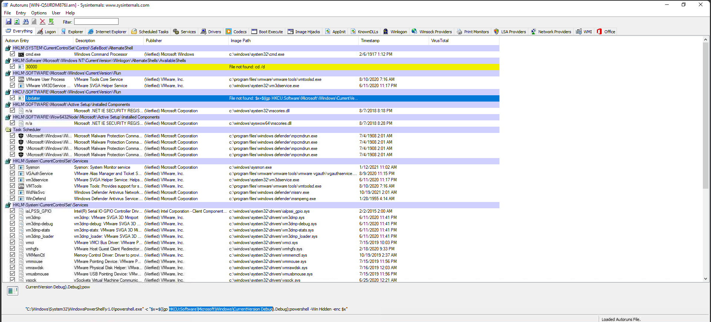
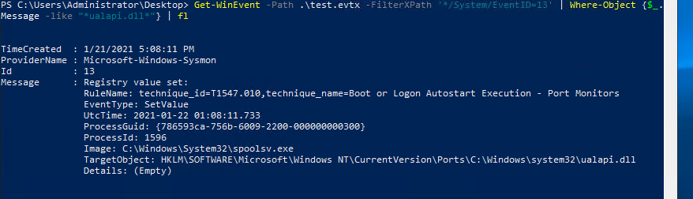

# Investigating Windows 3.x

**Category:** Digital Forensics & Incident Response (DFIR)
**Platform:** TryHackMe , [Investigating Windows 3.x](https://tryhackme.com/room/investigatingwindows3)
**Difficulty:** Medium
**Skills Demonstrated:** Windows Event Log analysis (Sysmon & native logs), Autoruns triage, PowerShell Base64 payload decoding, registry forensics, Process Monitor (Procmon) filtering, C2 framework identification, MITRE ATT&CK mapping

---

## 1. Scenario Overview

The scenario places the analyst in the role of an incident responder examining a compromised Windows host. Artifacts on disk (a Process Monitor capture and an Autoruns export) hint that an attacker achieved **persistence via a Registry Run key** containing a Base64-encoded payload. Decoding that payload reveals a second-stage, self-deleting payload that abuses the Windows **Fax service** to escalate/execute, followed by evidence of a **PowerShell `-EncodedCommand` launch**, outbound C2 communication consistent with the **Empire** post-exploitation framework, and ultimately **process injection** into a legitimate process (`Explorer.exe`) via `CreateRemoteThread`. The overall attack chain moves from disk-based persistence → payload execution → service abuse → C2 beaconing → in-memory process injection.

---

## 2. Tools Used

| Tool | Purpose |
|---|---|
| Autoruns (Sysinternals) | Identify the malicious persistence entry in the registry |
| Windows Event Viewer (custom views) | Filter Sysmon Event ID 13 (Registry value set) to locate the encoded payload |
| PowerShell (`Get-WinEvent`) | Query Sysmon/PrintService `.evtx` logs with `-FilterHashtable` and `-FilterXPath` |
| PowerShell (`[Convert]::FromBase64String`) | Decode the Base64-encoded PowerShell payloads |
| Process Monitor (Procmon) | Recover parent PID, first loaded image, and registry query operations not easily visible in Sysmon alone |
| nslookup | Resolve the attacker infrastructure IP to an FQDN |
| MITRE ATT&CK Navigator / attack.mitre.org | Map techniques to ATT&CK IDs and confirm framework attribution (Empire, S0363) |

---

## 3. Step-by-Step Walkthrough

### 3.1 Locating the Persistence Mechanism

The starting artifacts on the desktop were a Process Monitor capture (`Logfile.pml`) and an Autoruns export (`WIN-Q5JJRDM876J.arn`). Rather than working through the (very large) Procmon capture blind, the Autoruns export was reviewed first, since Autoruns already aggregates every persistence location into one list. A suspicious Run-key entry stood out immediately. The initial instinct was to report the generic `HKCU\SOFTWARE\Microsoft\Windows\CurrentVersion\Run` path, but the actual malicious value , visible in the **Image Path** column of the same Autoruns entry , pointed to a different, less common key used to stash the payload rather than launch it directly.

> 
> *Screenshot of the Autoruns entry showing the Image Path column, confirming the full registry path holding the Base64-encoded payload.*

**Findings:**

| Question | Answer |
|---|---|
| Registry key with the encoded payload (full path) | `HKCU\Software\Microsoft\Windows\CurrentVersion\Debug` |

### 3.2 Confirming Persistence via Sysmon

With the registry key identified, the next step was correlating it against Sysmon telemetry. No dedicated Sysmon log shortcut existed on the box, so the Sysmon channel had to be located manually inside Event Viewer, after which a custom view was created filtering on **Event ID 13** (`RegistryEvent (Value Set)`) , the event Sysmon raises whenever a registry value is written. Rather than paging through every Event ID 13 entry, an Event Viewer *Find* search for the keyword `Debug` (carried over from the registry path found in 3.1) jumped straight to the relevant record. This record's rule name, timestamp, and type gave the metadata needed to attribute the event, while a quick lookup of the associated MITRE ATT&CK ID confirmed the technique classification.

**Findings:**

| Question | Answer |
|---|---|
| Sysmon rule name generated for this run key | `T1547.001` |
| MITRE ATT&CK tactic(s) for this ID | Persistence, Privilege Escalation |
| UTC time of the Sysmon event | `2021-01-22 01:08:13.468` |
| Sysmon Event ID / Event Type | `13`, `SetValue` |

### 3.3 Decoding the First-Stage Payload

The Base64 blob stored in the `Debug` registry value was copied out to a text file and decoded locally with PowerShell:

```powershell
$payload = Get-Content .\payload.txt
[System.Text.Encoding]::ASCII.GetString([System.Convert]::FromBase64String($payload)) | Out-File -Encoding "ASCII" decoded_payload.txt
```

This works because PowerShell's `-EncodedCommand` mechanism (and many payload droppers that mimic it) simply Base64-encodes a plain ASCII/Unicode script , decoding is a straightforward Convert-class round trip, no cryptographic key required. The decoded script revealed a small service-abuse routine: it starts the **Fax** service, opens a local listening port, attempts to kill a specific process, and deletes a DLL , behavior consistent with a known **Print Spooler / Fax service persistence and defense-evasion trick** (the "PrintDemon"-style abuse referenced later in the room).

**Findings:**

| Question | Answer |
|---|---|
| Service the payload attempts to start | Fax |
| Local port the payload attempts to open | `9299` |
| Process the payload attempts to terminate | `FXSSVC` |
| DLL file the payload attempts to remove (full path) | `C:\Windows\System32\ualapi.dll` |

### 3.4 Correlating the Fax/Print Service Abuse with Windows Event Logs

Since the payload references the Fax service, the initial assumption was to search Fax-specific logs , `Get-WinEvent -ListLog *` filtered for "Fax" returned nothing useful, since fax-service events are actually logged under the **Print Service** provider (a reasonable pivot, since faxing on Windows is implemented on top of the print subsystem). Filtering that log directly with `-FilterHashtable` surfaced the relevant event, including the new default printer set as part of the abuse and the responsible process.

```powershell
Get-WinEvent -FilterHashtable @{logname="Microsoft-Windows-PrintService/Admin"} | fl
```

> 
> *Screenshot showing the print-service event record, including the associated Event ID, the new default printer value, and the responsible process (`spoolsv.exe`).*

**Findings:**

| Question | Answer |
|---|---|
| Windows Event ID associated with this service | `823` |
| New Default Printer listed | `PrintDemon` |
| Process associated with this event | `spoolsv.exe` |

### 3.5 Recovering the Parent PID via Process Monitor

`Get-WinEvent` alone was not sufficient to recover the parent PID of the process that targeted `ualapi.dll` , that detail was easier to pull from the raw Procmon capture (`Logfile.pml`) by filtering directly on the DLL filename and exposing the Parent PID column in the process tree view, since Procmon retains parent/child process relationships that some Sysmon event renderings can obscure.

For validation, the same registry-write event was also confirmed via Sysmon Event ID 13, filtering directly on the DLL name in the saved `.evtx`:

```powershell
Get-WinEvent -Path .\sysmon.evtx -FilterXPath '*/System/EventID=13' | Where-Object {$_.Message -like "*ualapi.dll*"} | fl
```

> 📷 **[Placeholder: Screenshot , "Get-WinEvent -FilterXPath EventID=13 filtered on ualapi.dll"]**
> *Screenshot confirming the process that touched `ualapi.dll` via the registry-event filter, cross-referenced against the Procmon-derived parent PID.*

**Findings:**

| Question | Answer |
|---|---|
| Parent PID for the process associated with the DLL removal | `620` |

### 3.6 Locating the Encoded-Command Execution

To find *which* process actually executed the encoded payload (as opposed to just writing it to the registry), the reasoning was: attackers commonly launch encoded PowerShell via the `-EncodedCommand` flag (or its short alias `-enc`). Searching Sysmon **Event ID 1** (Process Create) for the substring `enc` located the exact process-creation event carrying the Base64 blob in its command line.

```powershell
Get-WinEvent -Path .\sysmon.evtx -FilterXPath '*/System/EventID=1' | Where-Object {$_.Message -like "*enc*"} | fl
```

**Findings:**

| Question | Answer |
|---|---|
| PID of the process running the encoded payload | `3088` |

### 3.7 Decoding the Second-Stage Payload

The command-line payload from 3.6 was saved and decoded the same way as the first stage:

```powershell
$payload = Get-Content .\enc.txt
[System.Text.Encoding]::ASCII.GetString([System.Convert]::FromBase64String($payload)) | Out-File -Encoding "ASCII" decoded.txt
```

The decoded content exposed an HTTP request path used for staging/callback traffic.

**Findings:**

| Question | Answer |
|---|---|
| Visible partial path in the decoded payload | `/admin/get.php` |

### 3.8 Identifying the C2 Framework

`/admin/get.php` is a recognizable default URI pattern, so it was searched directly rather than reverse-engineered from scratch. The pattern matches the **default communication profile (`DefaultProfile`)** shipped with the **PowerShell Empire** post-exploitation framework, whose default HTTP listener profile rotates across a small set of URIs including an admin, a news, and a login-process path , all of which are plausible artifacts to expect elsewhere in the logs from the same C2 channel.

**Findings:**

| Question | Answer |
|---|---|
| Attack framework used / name of the variable | Empire, `DefaultProfile` |
| Other file paths likely to appear in the logs | `/news.php`, `/login/process.php` |
| MITRE ATT&CK Software URI for the framework | https://attack.mitre.org/software/S0363/ |

### 3.9 Identifying Outbound C2 Connections

Sysmon **Event ID 3** (Network Connection) was queried for the earliest outbound connection record, and the resulting destination IP was resolved to a hostname:

```powershell
Get-WinEvent -Path .\sysmon.evtx -FilterXPath '*/System/EventID=3' -Oldest -MaxEvent 1 | fl
```

A follow-up filter on the same destination IP across all Event ID 3 records revealed that a **second, unrelated-looking process** , `Explorer.exe` , also connected to the same attacker infrastructure, a strong indicator of process injection rather than a second independent compromise.

```powershell
Get-WinEvent -Path .\sysmon.evtx -FilterXPath '*/EventData/Data[@Name="DestinationIp"] = "34.245.128.161"' | fl
```

**Findings:**

| Question | Answer |
|---|---|
| FQDN of the attacker machine | `ec2-34-245-128-161.eu-west-1.compute.amazonaws.com` |
| Other process that connected to the attacker machine | `Explorer.exe` |
| PID of that process | `2684` |

### 3.10 Confirming Process Injection into Explorer.exe

Sysmon does not directly expose "first module loaded" in an easily queryable way, so Process Monitor was used instead, filtered on the target PID to find the first image load event for the injected process.

**Findings:**

| Question | Answer |
|---|---|
| Path of the first image loaded for the process from 3.9 | `C:\Windows\System32\mscoree.dll` |

### 3.11 Correlating the Injection Timeline

To scope the search window between the encoded-payload write (registry, Event ID 13) and its execution (process create, Event ID 1), both timestamps were pulled independently, then every Sysmon event in that window was enumerated:

```powershell
$stTime = Get-Date -Date "1/21/2021 5:05:45 PM"
$enTime = Get-Date -Date "1/21/2021 5:08:13 PM"
Get-WinEvent -Path .\sysmon.evtx -FilterXPath '*/System/*' | Where-Object {$_.TimeCreated -ge $stTime -and $_.TimeCreated -le $enTime}
```

Within that window, a **`CreateRemoteThread`** event (Sysmon Event ID 8) stood out as the clearest indicator of injection between the two processes identified earlier.

**Findings:**

| Question | Answer |
|---|---|
| Sysmon event generated between the two processes / Event ID | `CreateRemoteThread`, `8` |
| UTC time of the first such event | `2021-01-22 01:07:06.182` |
| Same value as local Date and Time | `1/21/2021 5:07:06 PM` |

### 3.12 Reconstructing Post-Injection Activity in Procmon

Filtering Procmon on the injected process's PID, starting from the timestamp in 3.11, surfaced the very first recorded operation for that process after injection , a **Thread Create**, consistent with a remote thread being spun up inside `Explorer.exe`'s address space.

**Findings:**

| Question | Answer |
|---|---|
| First operation listed by the second process at that timestamp | Thread Create |

### 3.13 Recovering the Reconnaissance Registry Query

Continuing to filter Procmon on the injected process, and narrowing by "registry query" operations, the attacker's tooling was found querying a registry value commonly used for host/OS fingerprinting (build/release ID) , typical of a C2 agent's initial system-recon "checkin" behavior.

**Findings:**

| Question | Answer |
|---|---|
| Full registry path queried for victim information | `HKLM\SOFTWARE\Microsoft\Windows NT\CurrentVersion\ReleaseID` |
| Name of the last module in the call stack with a successful result | `<unknown>` |

### 3.14 Attributing the Empire Module Used

Using **"process injection"** and **"CreateRemoteThread"** (the exact behavior confirmed in 3.11) as search terms, combined with "process injection powershell empire," led to Empire's dedicated process-injection module documentation, which matches the observed injection-into-Explorer.exe behavior.

**Findings:**

| Question | Answer |
|---|---|
| Empire module most likely used between the two processes | `Invoke-PSInject` |
| MITRE ATT&CK ID for this technique | `T1055` (Process Injection) |

---

## 4. Attack Chain Summary

```
[Initial Foothold / Registry Persistence]
        ▼
Base64 payload written to HKCU\...\CurrentVersion\Debug
   (Sysmon EID 13 , RegistryEvent, T1547.001)
        ▼
Payload decoded → abuses Fax/Print service (start service,
open port 9299, kill FXSSVC, delete ualapi.dll)
   (Windows Event ID 823 , PrintService/Admin, "PrintDemon")
        ▼
Second-stage encoded PowerShell executed (-enc)
   (Sysmon EID 1 , Process Create, PID 3088)
        ▼
Decoded command reveals Empire C2 URIs (/admin/get.php, DefaultProfile)
        ▼
Outbound C2 connection to ec2-...amazonaws.com
   (Sysmon EID 3 , Network Connection)
        ▼
CreateRemoteThread into Explorer.exe (PID 2684)
   (Sysmon EID 8 , Process Injection, T1055, Invoke-PSInject)
        ▼
Post-injection recon: registry query of CurrentVersion\ReleaseID
```

---

## 5. MITRE ATT&CK Mapping (Inline)

The two techniques explicitly confirmed within the room are:

- **T1547.001 – Boot or Logon Autostart Execution: Registry Run Keys / Startup Folder** , used for the initial Base64 payload persistence in `HKCU\Software\Microsoft\Windows\CurrentVersion\Debug` (Tactics: Persistence, Privilege Escalation).
- **T1055 – Process Injection** , used for the `CreateRemoteThread`-based injection into `Explorer.exe` via Empire's `Invoke-PSInject` module (Tactic: Defense Evasion, Privilege Escalation).

Additional adversary behaviors observed but not explicitly asked about in the room map loosely to **T1543.003 (Windows Service abuse)** for the Fax/PrintDemon service manipulation, and **T1071.001 (Application Layer Protocol: Web Protocols)** for the HTTP-based Empire C2 channel , these are supplementary analyst annotations and should be validated against the live ATT&CK Navigator before being used in any formal reporting.

---

## 6. OWASP Applicability

Not applicable. This engagement is a host-based DFIR / malware-analysis scenario (registry persistence, service abuse, and C2/process injection on a single Windows endpoint) with no web application component in scope. The MITRE ATT&CK framework, already applied above, is the more appropriate reference model for this type of engagement than the OWASP Top 10.

---

## 7. Indicators of Compromise (IOC) Summary

| Type | Indicator |
|---|---|
| Registry Key | `HKCU\Software\Microsoft\Windows\CurrentVersion\Debug` |
| File Path | `C:\Windows\System32\ualapi.dll` (targeted for deletion) |
| Local Port | `9299` |
| Service/Process | `Fax` service, `FXSSVC` (targeted for termination) |
| Printer Name | `PrintDemon` |
| Process (legitimate, injected) | `Explorer.exe` (PID 2684) |
| Process (payload runner) | PID `3088` |
| C2 URIs | `/admin/get.php`, `/news.php`, `/login/process.php` |
| C2 Infrastructure (FQDN) | `ec2-34-245-128-161.eu-west-1.compute.amazonaws.com` |
| C2 Infrastructure (IP) | `34.245.128.161` |
| Framework Identifier | Empire (`DefaultProfile` HTTP listener profile), MITRE S0363 |
| Registry Recon Query | `HKLM\SOFTWARE\Microsoft\Windows NT\CurrentVersion\ReleaseID` |

---

## 8. Key Findings & Risk Summary

| Weakness | Impact | Recommendation |
|---|---|---|
| Attacker-writable `HKCU\...\CurrentVersion\Debug` value used for payload storage | Allows disk-based persistence and staged payload delivery without triggering common Run-key monitoring | Alert on writes to non-standard registry value names under `CurrentVersion`, not just the well-known `Run`/`RunOnce` keys |
| Abuse of the Fax/Print Spooler service to manipulate default printer and kill/tamper with system binaries | Enables defense evasion (deleting `ualapi.dll`) and local service disruption with a "legitimate" service | Restrict which accounts/processes can modify `PrintService` configuration; monitor Event ID 823 for unexpected default-printer changes |
| Use of `powershell -EncodedCommand` for both stages | Obfuscates payload content from casual log review and simple string-based detections | Enable and monitor Sysmon Event ID 1 with alerting on `-enc`/`-EncodedCommand` flags; enable PowerShell Script Block Logging |
| In-memory process injection into `Explorer.exe` via Empire's `Invoke-PSInject` | Hides malicious code inside a trusted, always-running process, evading process-listing based detection | Monitor Sysmon Event ID 8 (`CreateRemoteThread`) targeting common LOLBins/system processes; deploy EDR with injection-technique detections |
| Unencrypted/plaintext-pattern HTTP C2 channel with default framework URIs | Default, well-documented Empire URIs are easy to fingerprint once known, but easy to miss if signatures aren't updated | Maintain signature/IOC feeds for known C2 framework default profiles; consider network egress filtering and TLS inspection |

---

## 9. Key Takeaways

- Autoruns is a faster first stop than raw Procmon/Sysmon logs when hunting for persistence , it aggregates every common autostart location into one triage-friendly view.
- Not every service-related event lives under the log name you'd intuitively guess (Fax abuse logged under `PrintService/Admin`, not a "Fax" log) , knowing the underlying subsystem matters more than the surface-level service name.
- `-EncodedCommand` / `-enc` is a high-value, low-effort string to hunt for in Sysmon Event ID 1 command lines when triaging PowerShell-based intrusions.
- Recognizable default artifacts (URIs, variable names, listener profile names) are often the fastest way to fingerprint a known C2 framework , search them before trying to reverse-engineer behavior from scratch.
- A process reaching out to the same C2 IP as a known-malicious process, especially a normally benign one like `Explorer.exe`, is a strong signal of process injection and warrants a `CreateRemoteThread` (Sysmon EID 8) pivot.
- Sysmon and Process Monitor are complementary, not redundant , some details (parent PID trees, first-loaded-image order, granular registry query operations) are far easier to recover from Procmon than from Sysmon's event rendering alone.

---

## 10. References

- Fatos Shala, *"THM - Investigating Windows 3.x"*, Faetu's Space, 9 August 2024 (original methodology reference).
- TryHackMe , [Investigating Windows 3.x](https://tryhackme.com/room/investigatingwindows3)
- MITRE ATT&CK , [T1547.001: Boot or Logon Autostart Execution: Registry Run Keys / Startup Folder](https://attack.mitre.org/techniques/T1547/001/)
- MITRE ATT&CK , [T1055: Process Injection](https://attack.mitre.org/techniques/T1055/)
- MITRE ATT&CK , [S0363: Empire](https://attack.mitre.org/software/S0363/)
- Sysinternals , [Autoruns](https://learn.microsoft.com/en-us/sysinternals/downloads/autoruns), [Process Monitor](https://learn.microsoft.com/en-us/sysinternals/downloads/procmon)
- Microsoft Learn , [Get-WinEvent documentation](https://learn.microsoft.com/en-us/powershell/module/microsoft.powershell.diagnostics/get-winevent)
- BC-Security , [Empire Project](https://github.com/BC-SECURITY/Empire)
