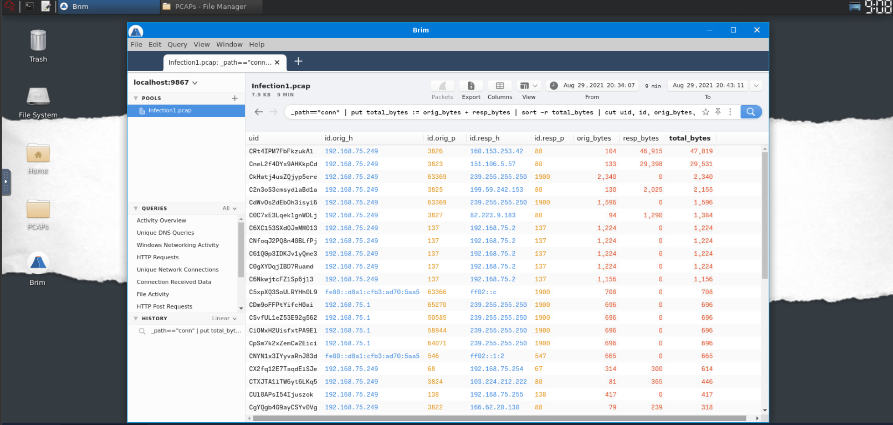
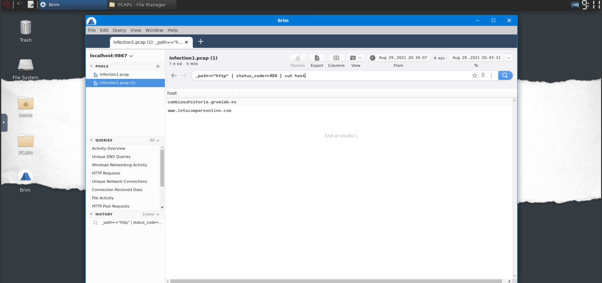
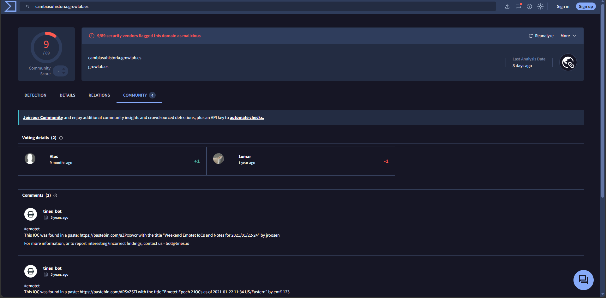
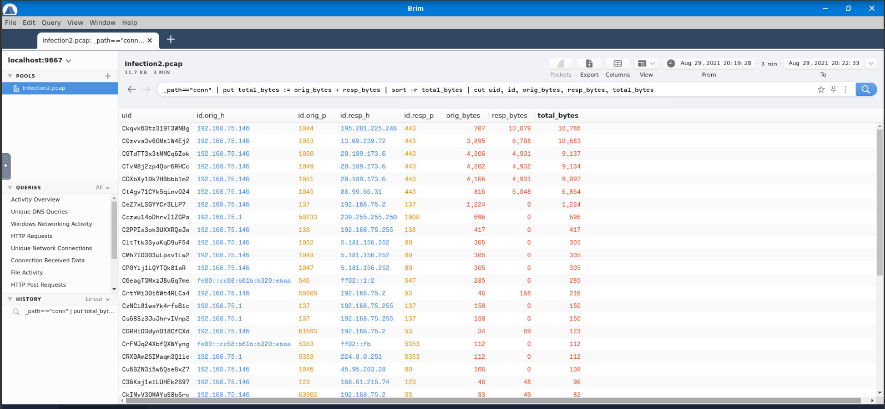
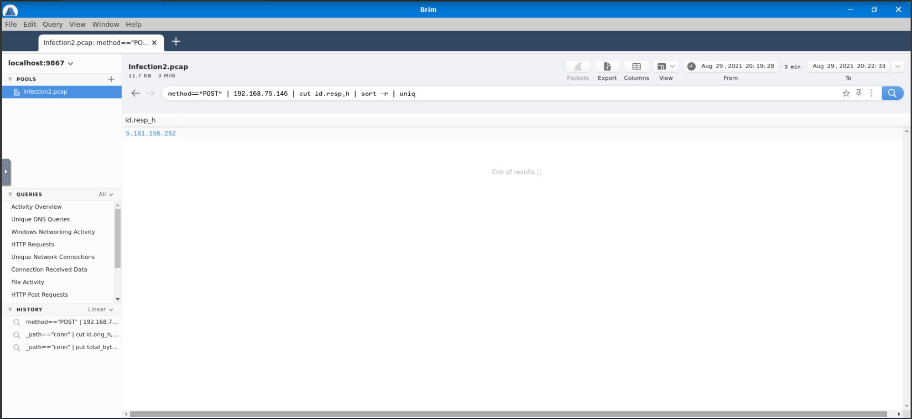
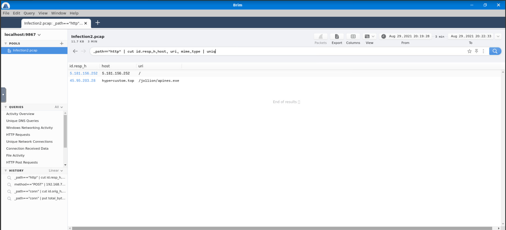
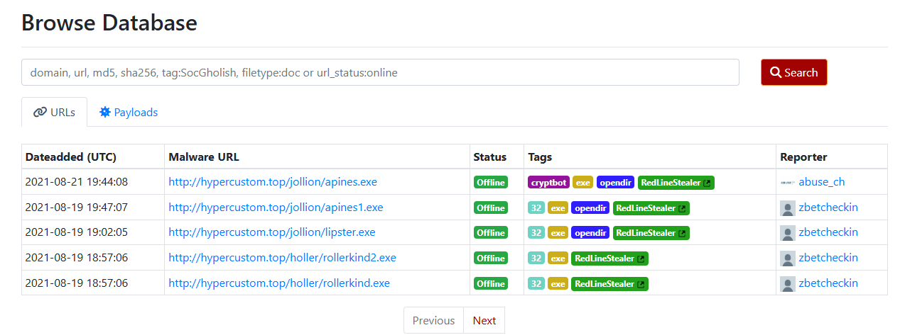

# Masterminds 

**Category:** Digital Forensics & Incident Response (DFIR) / Network Traffic Analysis
**Platform:** TryHackMe (Room: [Masterminds](https://tryhackme.com/room/mastermindsxlq))
**Difficulty:** Medium
**Skills Demonstrated:** Zeek/Brim log analysis, PCAP triage, HTTP/DNS traffic hunting, Suricata alert review, malware identification via VirusTotal & URLhaus, basic OSINT


---

## 1. Scenario Overview

Pfeffer PLC's Finance department suffered three separate endpoint compromises. The incident response team suspects two initial infection vectors ,a phishing email and an infected USB drive ,and captured network traffic (PCAPs) from the affected hosts. The objective of the room is to use **Brim** to parse the Zeek logs embedded in each PCAP, reconstruct each infection chain (victim identification → C2/dropper traffic → payload download → malware family attribution), and ultimately attribute the campaigns to known malware families using open-source intelligence (VirusTotal, URLhaus, and general OSINT).

The engagement is split into three independent infection scenarios, each analyzed as its own PCAP:

- **Infection 1** ,an Emotet infection delivered via malicious document/HTTP traffic.
- **Infection 2** ,a Redline Stealer infection with a `.top` C2 domain and Suricata-flagged trojan activity.
- **Infection 3** ,a Phorphiex worm infection using rotating `.ru` C2 domains to serve binaries.

---

## 2. Tools Used

| Tool | Purpose |
|---|---|
| **Brim** | Loading PCAPs, running Zeek-log-backed queries (`conn`, `http`, `dns`, alert logs) to triage traffic |
| **Zeek** (underlying Brim's parser) | Generates the `conn`, `http`, `dns`, and `notice`/alert logs Brim queries against |
| **Suricata** | Source of the "A Network Trojan was detected" IDS alerts reviewed in Infection 2 |
| **VirusTotal** | Malware family attribution for the Infection 1 executable |
| **URLhaus Database** | Malware family attribution for the Infection 2 `.top` domain |
| **OSINT (search engines)** | Attributing the Infection 3 `.ru` C2 domain to the Phorphiex worm |

---

## 3. Step-by-Step Walkthrough

### Task 2 ,Infection 1

**Objective:** Load `Infection1` from `/home/ubuntu/Desktop/PCAPs` in Brim and trace the compromise.

**Identifying the victim IP.** The fastest way to spot the victim on a flat internal subnet is to look at total bytes transferred per connection ,a compromised host generating C2/exfil traffic tends to stand out:

```
_path=="conn" | put total_bytes := orig_bytes + resp_bytes | sort -r total_bytes | cut uid, id, orig_bytes, resp_bytes, total_bytes
```

The private address with disproportionately high total byte volume and outbound connections to external hosts is the compromised endpoint.

> 
> *Sorted `conn` log showing the victim's IP standing out by total bytes transferred.*

**Finding failed connections to suspicious domains.** Filtering the `http` log for 404 responses surfaces domains the malware attempted to reach that were no longer live or were sinkholed:

```
_path=="http" | status_code==404 | cut host
```

> 
> *List of hosts returning a 404 status to the victim.*

**Finding the successful callback and downloaded payload.** Filtering `http` traffic by response body size and status isolates the request that actually returned content, and cutting `id.orig_h`, `id.resp_h`, `method`, `host`, and `uri` (with `uniq -c`) surfaces the download of the malicious executable and its C2 host.

**Malware attribution.** Submitting the downloaded executable's indicators to VirusTotal identified the payload as **Emotet**.

> 
> *VirusTotal detections confirming the Emotet malware family for the downloaded executable.*

#### Findings ,Infection 1

| Question | Answer |
|---|---|
| Victim's IP address | `192.168.75.249` |
| Two domains returning HTTP 404 | `cambiasuhistoria.growlab.es`, `www.letscompareonline.com` |
| Domain + IP with successful HTTP response (body len 1,309) | `ww25.gocphongthe.com`, `199.59.242.153` |
| Unique DNS requests to `cab[.]myfkn[.]com` (incl. capitalized variant) | `7` |
| URI reached on `bhaktivrind[.]com` | `/cgi-bin/JBbb8/` |
| Malicious server IP + downloaded executable | `185.239.243.112`, `catzx.exe` |
| Malware family (VirusTotal) | `Emotet` |

---

### Task 3 ,Infection 2

**Objective:** Load `Infection2` and repeat the analysis on the second compromised host.

**Identifying the victim IP.** Same `conn`-log, total-bytes approach as Infection 1 was used, cross-checked against Brim's built-in "numerous suspicious connections to a single IP" query. Addresses ending in `.1` were excluded as gateway addresses rather than hosts.

> 
> *`conn` log sorted by total bytes, isolating the second victim host and its high-volume external destination.*

**Isolating POST traffic (C2 beaconing / exfil).** Filtering the `http` log for `method=="POST"` scoped to the victim IP, then cutting the destination IP and de-duplicating, reveals the C2 server the victim repeatedly checked in with:

```
method=="POST" | 192.168.75.146 | cut id.resp_h | sort -r | uniq
```

>
> *Unique destination IP receiving POST requests from the victim, with a repeat count confirming 3 POST connections.*

**Finding the dropped binary.** Cutting the destination IP, host, URI, and MIME type from the `http` log and de-duplicating exposes the executable download, its full path, and the hosting infrastructure:

```
_path=="http" | cut id.resp_h, host, uri, mime_type | uniq
```

> 
> *HTTP request showing the `.top` domain, binary URI, and hosting IP for the dropped executable.*

**Correlating with IDS alerts.** Two Suricata "A Network Trojan was detected" alerts were raised, both pairing the victim with the same binary-hosting IP ,corroborating the traffic-log findings independently.

**Malware attribution.** Looking up the `.top` C2 domain in the URLhaus Database identified the family as **Redline Stealer**, a credential/info-stealing trojan.

> 
> *URLhaus entry for the `.top` domain, tagging the payload as Redline Stealer.*

#### Findings ,Infection 2

| Question | Answer |
|---|---|
| Victim's IP address | `192.168.75.146` |
| IP receiving POST connections | `5.181.156.252` |
| Number of POST connections | `3` |
| Domain hosting the binary | `hypercustom.top` |
| Binary name + full URI | `/jollion/apines.exe` |
| IP address hosting the binary | `45.95.203.28` |
| Suricata "Network Trojan" alert ,source, destination | `192.168.75.146`, `45.95.203.28` |
| Stealer family (URLhaus) | `Redline Stealer` |

---

### Task 4 ,Infection 3

**Objective:** Load `Infection3` and analyze the third and final compromised host.

**Identifying the victim IP.** The same `conn`-log total-bytes approach again isolates the compromised internal host by its abnormal outbound volume.

**Tracking C2 domain rotation.** This infection used **domain rotation** across three lookalike `.ru` domains to serve binaries over time. Sorting `http` requests by timestamp and cutting the host/URI fields recovers the domains in the order the malware actually contacted them, along with the IPs each resolved to.

**Quantifying DNS activity against the first C2 domain.** Counting DNS queries grouped by `query` and filtering to the first domain shows how many distinct lookups the host made against it, and cutting the `http` log by URI/MIME type for that same domain shows how many distinct binaries were served from it ,with the associated `User-Agent` string identifying the HTTP client used for the downloads.

**Scoping total DNS volume.** Counting and summing all DNS queries in the capture gives a sense of the overall noise/beaconing volume generated by the worm across the session.

**Worm attribution (OSINT).** Searching the first C2 domain (quoted, with the `.ru` TLD omitted from the query, and without visiting the domain directly) identified the malware family as the **Phorphiex** worm, known for spreading via removable media and spam, and for downloading secondary payloads (cryptominers, ransomware, stealers) from rotating C2 infrastructure ,consistent with the USB-drive infection vector suspected for this department.

#### Findings ,Infection 3

| Question | Answer |
|---|---|
| Victim's IP address | `192.168.75.232` |
| Three C2 domains (earliest → latest) | `efhoahegue.ru`, `afhoahegue.ru`, `xfhoahegue.ru` |
| IP addresses for the three domains | `162.217.98.146`, `199.21.76.77`, `63.251.106.25` |
| Unique DNS queries to the domain at the first IP | `2` |
| Binaries downloaded from that domain | `5` |
| User-Agent used for the downloads | `Mozilla/5.0 (Macintosh; Intel Mac OS X 10.9; rv:25.0) Gecko/20100101 Firefox/25.0` |
| Total DNS connections in the capture | `986` |
| Worm family (OSINT) | `Phorphiex` |

---

## 4. Attack Chain Summary

```
Phishing Email / Infected USB Drive
            ▼
   Initial Execution on Finance Endpoint
            ▼
   ┌────────────────────────────────────────────┐
   │  Infection 1        Infection 2       Infection 3 │
   │  HTTP callback  →   HTTP POST beacon → DNS-rotated │
   │  to 404'd domains   to C2 (5.181...)   .ru C2 domains │
   │  then successful    then binary        (efhoahegue.ru → │
   │  download from      download from      afhoahegue.ru → │
   │  185.239.243.112    hypercustom.top    xfhoahegue.ru)  │
   │  (catzx.exe)        (apines.exe)       serving 5 binaries│
   └────────────────────────────────────────────┘
            ▼                    ▼                    ▼
        Emotet              Redline Stealer        Phorphiex Worm
     (loader/banking       (credential/info-      (self-propagating
      trojan)               stealing trojan)       worm, secondary
                                                    payload delivery)
```

Each host followed the same broad pattern ,DNS resolution → outbound HTTP(S) callback → payload retrieval ,but the payload family and C2 infrastructure differed per host, indicating either multiple simultaneous campaigns or a multi-stage compromise dropping different tooling on different endpoints.

Adversary behavior throughout maps loosely to MITRE ATT&CK **Initial Access** (Phishing / Replication Through Removable Media), **Command and Control** (Application Layer Protocol ,HTTP, and rotated/fluxed C2 domains), and **Exfiltration/Collection** (credential theft via Redline Stealer) ,these are noted inline here rather than as a dedicated mapping table, per the scope of this report.

---

## 5. OWASP Applicability

This engagement is a **network forensics / malware traffic analysis** exercise with no web application under test ,there is no application logic, authentication flow, or server-side code being assessed. The **OWASP Top 10** is therefore **not applicable** to this scope. A more fitting reference framework here would be **MITRE ATT&CK** (already referenced inline above) alongside threat-intel resources such as **URLhaus** and **VirusTotal**, which are purpose-built for malware/C2 attribution rather than web application risk.

---

## 6. Indicators of Compromise (IOC) Summary

| Type | Indicator | Associated Infection |
|---|---|---|
| Internal IP (victim) | `192.168.75.249` | Infection 1 |
| Domain (404, no payload) | `cambiasuhistoria.growlab.es` | Infection 1 |
| Domain (404, no payload) | `www.letscompareonline.com` | Infection 1 |
| Domain + IP (successful HTTP) | `ww25.gocphongthe.com` / `199.59.242.153` | Infection 1 |
| Domain | `cab.myfkn.com` | Infection 1 |
| Domain + URI | `bhaktivrind.com` / `/cgi-bin/JBbb8/` | Infection 1 |
| Malicious server IP + payload | `185.239.243.112` / `catzx.exe` | Infection 1 |
| Malware family | Emotet | Infection 1 |
| Internal IP (victim) | `192.168.75.146` | Infection 2 |
| C2 IP (POST destination) | `5.181.156.252` | Infection 2 |
| Domain hosting binary | `hypercustom.top` | Infection 2 |
| Payload URI | `/jollion/apines.exe` | Infection 2 |
| Hosting IP | `45.95.203.28` | Infection 2 |
| Malware family | Redline Stealer | Infection 2 |
| Internal IP (victim) | `192.168.75.232` | Infection 3 |
| C2 domain | `efhoahegue.ru` / `162.217.98.146` | Infection 3 |
| C2 domain | `afhoahegue.ru` / `199.21.76.77` | Infection 3 |
| C2 domain | `xfhoahegue.ru` / `63.251.106.25` | Infection 3 |
| Malware family | Phorphiex (worm) | Infection 3 |

---

## 7. Key Findings & Risk Summary

| Weakness | Impact | Recommendation |
|---|---|---|
| No egress filtering/DNS monitoring caught outbound callbacks to newly-seen or lookalike domains | Multiple hosts freely reached external C2 infrastructure over standard HTTP | Deploy DNS sinkholing/RPZ and egress proxy filtering with reputation-based blocking for newly registered/lookalike domains |
| Removable media (USB) allowed as an infection vector | Enabled the Phorphiex worm to spread without any network-based delivery | Enforce USB device control policy (allow-listing, autorun disabled, endpoint DLP) |
| Users able to execute unsigned/unexpected executables from HTTP downloads | Emotet, a stealer, and a worm all successfully executed on Finance endpoints | Application allow-listing (e.g., Windows Defender Application Control) and email/attachment sandboxing at the gateway |
| No visible network segmentation between Finance workstations | Lateral spread risk once one host was compromised | Segment Finance department endpoints from general corporate network; restrict east-west traffic |
| Detection relied on manual post-incident PCAP triage | Delayed detection/response window | Feed Suricata alerts and Zeek logs into a SIEM with automated alerting on "Network Trojan" signatures and repeated POST beaconing patterns |

---

## 8. Key Takeaways

- Sorting the Zeek `conn` log by total bytes transferred (`orig_bytes + resp_bytes`) is a fast, reliable first pass for spotting a compromised host on a flat subnet, even before any signature-based alert fires.
- HTTP status codes matter for triage: 404s from the victim often reveal dead/sinkholed C2 infrastructure worth noting, while successful (200) responses with meaningful `response_body_len` point to actual payload delivery.
- Repeated POST requests to a single external IP are a strong beaconing/exfiltration signal and are worth isolating early with a targeted `method=="POST"` filter.
- Threat-intel enrichment (VirusTotal, URLhaus) turns a raw IOC (hash, domain, IP) into an actionable malware family attribution ,always the last step after the traffic-level facts are established.
- Domain rotation across visually similar TLDs (e.g., `efhoahegue.ru` → `afhoahegue.ru` → `xfhoahegue.ru`) is a common C2 resilience technique and is best recovered by sorting HTTP/DNS logs chronologically rather than alphabetically.
- Different malware families (a loader, a stealer, and a worm) compromising the same department in the same incident window is a strong indicator of either multiple concurrent campaigns or a broader, multi-vector compromise ,worth escalating beyond single-host remediation.

---

## 9. References

- TryHackMe, Room: [Masterminds](https://tryhackme.com/room/mastermindsxlq)
- [Brim / Zui](https://zui.brimdata.io/) ,network log query tool
- [Zeek](https://zeek.org/) ,network traffic analysis framework
- [Suricata](https://suricata.io/) ,network IDS/IPS
- [VirusTotal](https://www.virustotal.com/)
- [URLhaus Database](https://urlhaus.abuse.ch/)
- [MITRE ATT&CK](https://attack.mitre.org/)
