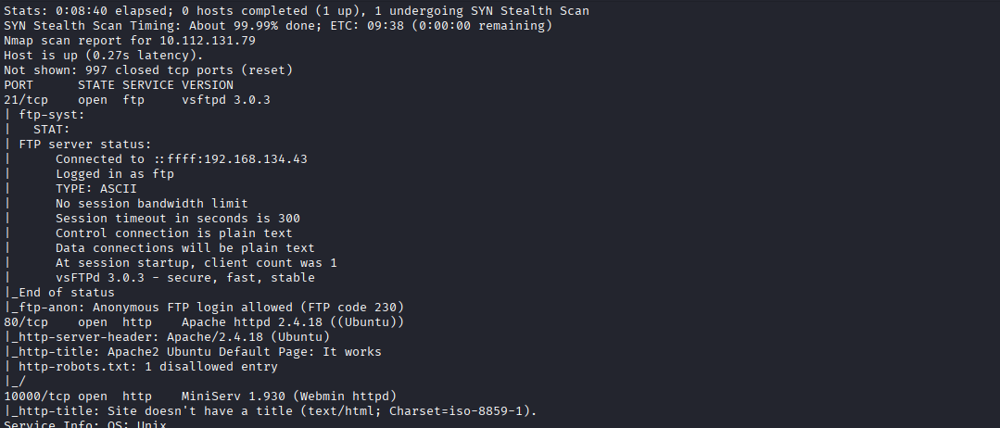
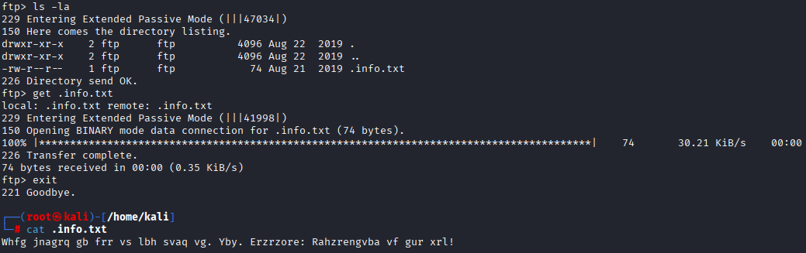
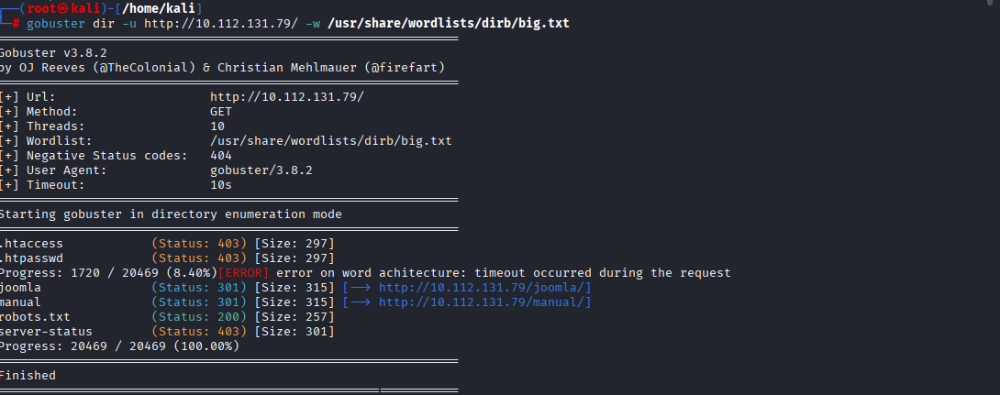
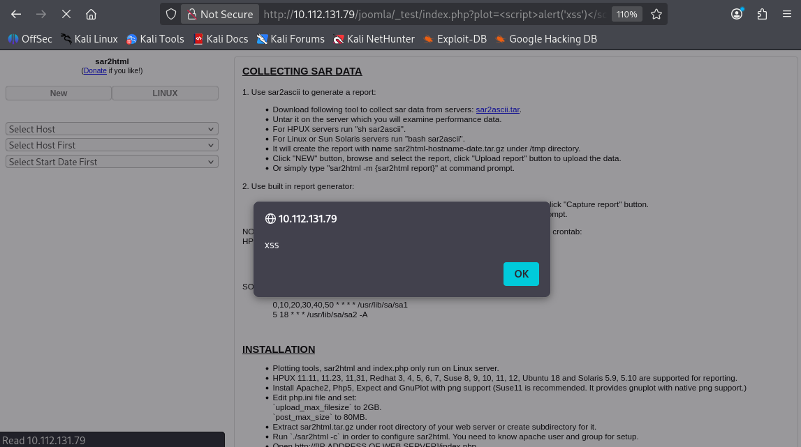
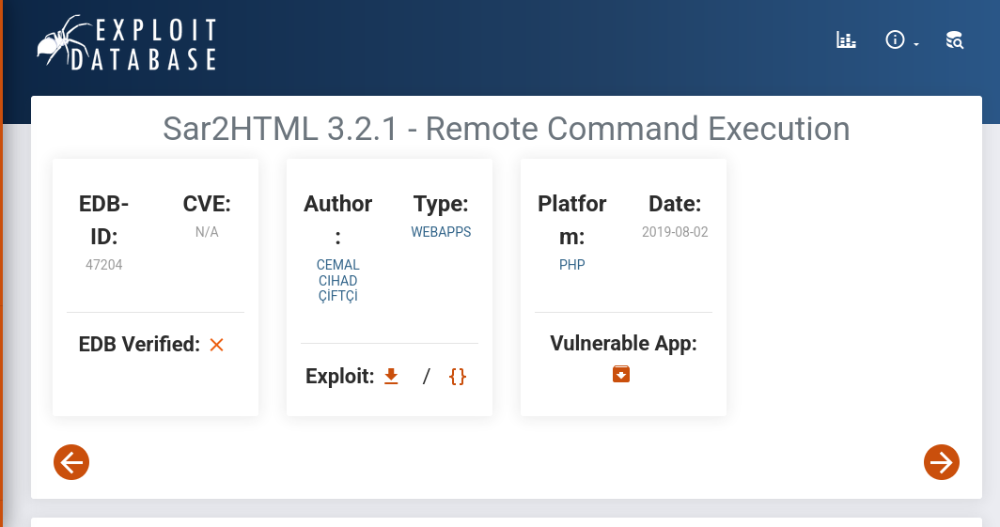
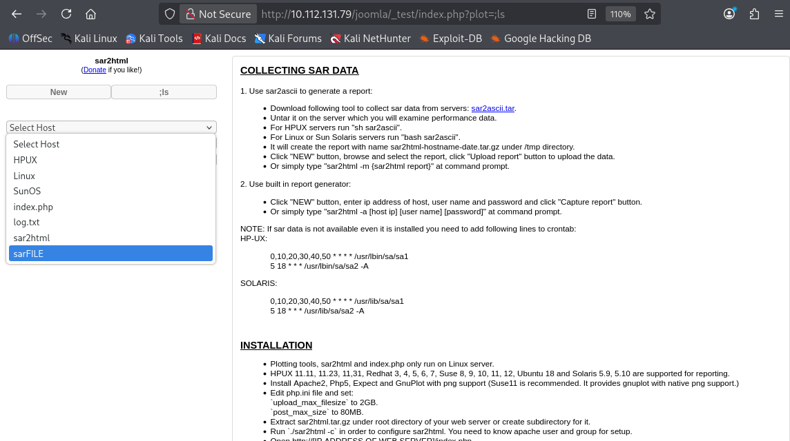
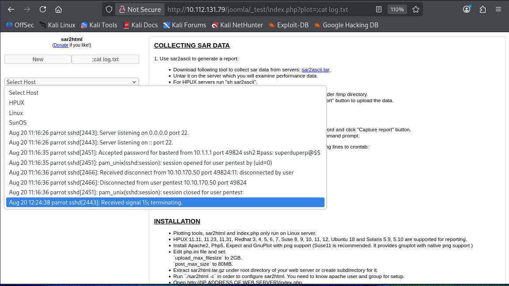
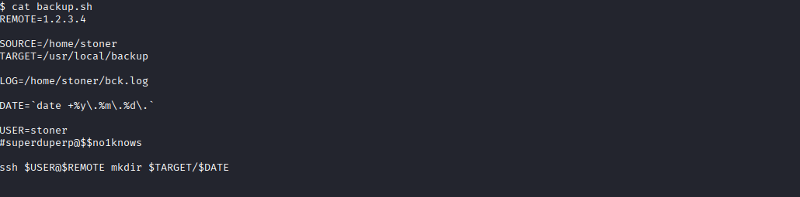

# Boiler CTF

**Category:** Web Exploitation / Linux Privilege Escalation
**Platform:** TryHackMe
**Difficulty:** Medium
**Skills Demonstrated:** Network Enumeration, Anonymous FTP Abuse, Directory Brute-Forcing, Reflected XSS, Remote Command Injection (sar2html), Credential Harvesting, SUID Binary Abuse for Privilege Escalation


## Scenario Overview

Boiler CTF is a Linux-based boot2root machine that chains together weak service configuration and web misconfiguration to reach a root shell. The attack path runs: enumerate exposed services (FTP, HTTP, Webmin, SSH) → find a CMS (Joomla) with a vulnerable custom endpoint → achieve remote command execution through a known third-party plugin vulnerability (`sar2html`) → harvest a plaintext credential from an application log file → pivot via SSH → discover a second user's password inside a backup script → escalate privileges using a misconfigured/abusable SUID binary (`find`) to obtain a root shell.

## Tools Used

| Tool | Purpose |
|---|---|
| `nmap` | Service and version discovery, full port sweep |
| `ftp` | Anonymous FTP enumeration and file retrieval |
| `gobuster` | Web directory/content brute-forcing |
| Web browser (manual testing) | Reflected XSS confirmation, CMS reconnaissance |
| `sar2html` (via Exploit-DB) | Identifying and leveraging a known RCE vulnerability |
| `nc` / interactive shell | Post-exploitation command execution |
| `ssh` / `scp` | Lateral movement, credential reuse |
| `find` (SUID) | Privilege escalation to root |

## Step-by-Step Walkthrough

### 1. Network Enumeration

Unlike the source writeup, which ran a single `nmap -sC -sV` scan, I ran a **two-stage scan**: an initial `-sC -sV` scan against the top ports, followed by a full `-p-` sweep across all 65535 ports. This second pass was what actually surfaced SSH running on a **non-standard high port (55007)** rather than the default port 22 — a detail that a top-1000-ports-only scan would have missed entirely, and one of the room's key "gotchas."

```bash
nmap -sC -sV <target-ip>
nmap -p- <target-ip>
```

The scan identified:

- **Port 21** — `vsftpd 3.0.3`, with **anonymous login allowed**
- **Port 80** — Apache 2.4.18 (Ubuntu), default page, `robots.txt` present
- **Port 10000** — `MiniServ 1.930` (Webmin)
- **Port 55007** — SSH (discovered only via the full-range scan)

> 
> *Shows the combined output of the `-sC -sV` and `-p-` scans, highlighting the four open ports and confirming SSH was relocated to port 55007 rather than 22.*

**Findings table**

| Question | Answer |
|---|---|
| What is on the highest port? | ssh |
| What's running on port 10000? | webmin |
| Can you exploit the service running on that port? (yay/nay) | nay |

### 2. Anonymous FTP Enumeration

FTP allowed anonymous access, exposing a single hidden file.

```bash
ftp <target-ip>
# Name: anonymous / Password: <blank>
ls -al
get .info.txt
```

> 
> *Shows the anonymous FTP session, the directory listing revealing the hidden `.info.txt` file, and the successful `get` transfer.*

The retrieved file contained a ROT13-encoded message hinting that thorough enumeration — not this file itself — was the actual path forward. Decoding it (shifting each letter by 13 positions) revealed a plain-English note essentially saying "just wanted to see if you'd find this; enumeration is the real key," confirming it was a red herring rather than a usable credential or path.

**Findings table**

| Question | Answer |
|---|---|
| File extension after anon login | txt |

### 3. Web Enumeration

I ran **two separate `gobuster` scans** rather than one: the first against the web root to discover top-level content, and a second scan specifically against the `/joomla/` directory once it was identified, to enumerate Joomla-specific paths and files that a single root-level scan would not surface.

```bash
gobuster dir -u http://<target-ip> -w /usr/share/wordlists/dirb/common.txt
gobuster dir -u http://<target-ip>/joomla -w /usr/share/wordlists/dirb/common.txt
```

> 
> *Shows the first gobuster run against the web root, revealing the `/joomla` and `/manual` directories.*

The root-level scan revealed a `/joomla` directory (redirecting to `/joomla/`) alongside the default Apache manual and a `robots.txt`. The follow-up scan against `/joomla/` surfaced the CMS frontend, an `/administrator` login portal, and a custom, non-standard `_test` endpoint accepting a `plot` parameter — the latter turning out to be the actual entry point into the box.

**Findings table**

| Question | Answer |
|---|---|
| What CMS can you access? | joomla |

### 4. Reflected XSS on the Custom Endpoint

The discovered `_test` endpoint reflected the `plot` parameter directly into the page without sanitization:

```
/joomla/_test/?plot=<script>alert('xss')</script>
```

> 
> *Shows the JavaScript alert box firing, confirming the `plot` parameter is reflected unsanitized into the response.*

This confirmed a reflected XSS vulnerability, but XSS alone offered no direct path to code execution or file access on the server, so it was treated as a secondary finding and the testing moved on to injection-style payloads against the same parameter.

### 5. Identifying the Underlying Vulnerable Component (sar2html)

Continued probing of the `plot` parameter and the surrounding application pointed to **sar2html**, a known third-party reporting plugin with a publicly documented remote command execution vulnerability. I looked this up directly on Exploit-DB to confirm the exact vulnerable parameter and payload syntax rather than guessing at injection strings blindly.

> 
> *Shows the public Exploit-DB advisory for the sar2html RCE vulnerability, confirming the vulnerable parameter and injection syntax used against the `plot` parameter.*

### 6. Remote Command Execution

Rather than using a Python-based reverse shell one-liner (as in the source writeup), I achieved code execution directly through the vulnerable parameter itself, chaining a semicolon-based command injection: `plot=;<command>`. This gave direct, interactive-style command output in the HTTP response without needing to catch a shell first.

```
/joomla/_test/?plot=;ls
/joomla/_test/?plot=;cat log.txt
```

> 
> *Shows the `plot=;ls` request returning a directory listing of the web application folder, confirming command execution.*

Running `ls` in the web directory revealed `index.php`, `log.txt`, `sar2html`, and `sarFILE` — confirming `log.txt` as the interesting artifact in the folder.

> 
> *Shows the `plot=;cat log.txt` request output, containing an SSH authentication log entry with a plaintext password for the user `basterd`.*

The log file contained an SSH authentication record showing a successful login for the user `basterd`, with the password embedded directly alongside the log line — a plaintext credential leak in an application log the web server had read access to.

**Findings table**

| Question | Answer |
|---|---|
| The interesting file name in the folder? | log.txt |

### 7. SSH Access and Lateral Movement

Using the harvested credential, I authenticated over SSH on the non-standard port identified during the full port sweep (port 55007):

```bash
ssh basterd@<target-ip> -p 55007
```

Enumerating the home directory surfaced a `backup.sh` script owned by another local user, `stoner`. The script — intended to automate off-host backups over SSH/`scp` — contained a **hardcoded plaintext credential in a comment line**.

> 
> *Shows the contents of `backup.sh` in `basterd`'s home directory, with the `stoner` user's password left in a comment line within the script.*

```bash
cat backup.sh
su stoner
```

**Findings table**

| Question | Answer |
|---|---|
| Where was the other user's pass stored (no extension, just the name)? | backup |
| user.txt | *(flag value withheld per room convention — captured from `stoner`'s home directory)* |

### 8. Privilege Escalation

`sudo -l` showed a NOPASSWD entry for a nonexistent/irrelevant custom binary, which was a dead end. Enumerating SUID binaries instead surfaced a directly exploitable target:

```bash
sudo -l
find / -perm -4000 2>/dev/null
```

The SUID bit set on the `find` binary itself (`/usr/bin/find`) allows spawning a privileged shell directly through its `-exec` flag:

```bash
cd /usr/bin
./find . -exec /bin/sh -p \; -quit
```

This dropped into a `sh` shell running with root privileges, confirmed via `whoami`, and `root.txt` was retrieved from `/root/`.

**Findings table**

| Question | Answer |
|---|---|
| What did you exploit to get the privileged user? | find |
| root.txt | *(flag value withheld per room convention — captured from `/root/root.txt`)* |

## Attack Chain Summary

```
Anonymous FTP (recon-only)
        ▼
Full port sweep → SSH hidden on port 55007
        ▼
Gobuster (root) → /joomla discovered
        ▼
Gobuster (/joomla) → custom _test?plot= endpoint found
        ▼
Reflected XSS confirmed (dead end for RCE)
        ▼
sar2html vulnerability identified (Exploit-DB)
        ▼
Command injection via plot=;<command> → RCE
        ▼
cat log.txt → basterd's SSH password leaked
        ▼
SSH login (port 55007) as basterd
        ▼
backup.sh → stoner's password hardcoded in comment
        ▼
su stoner → user.txt
        ▼
SUID find binary → root shell → root.txt
```

*(Relevant MITRE ATT&CK techniques — e.g., T1595 Active Scanning, T1190 Exploit Public-Facing Application, T1552.001 Credentials in Files, T1078 Valid Accounts, and T1548.001 Abuse Elevation Control Mechanism (Setuid) — are called out inline above rather than in a separate mapping table, per the requested report scope.)*

## OWASP Applicability

This engagement has a clear web application component (Joomla CMS, a custom vulnerable endpoint, reflected XSS, and remote command injection), so an OWASP Top 10 mapping is directly relevant:

| OWASP Category | Relevance to This Engagement |
|---|---|
| A03:2021 – Injection | The core foothold: the `plot` parameter allowed OS command injection via the vulnerable `sar2html` component, leading directly to RCE. |
| A05:2021 – Security Misconfiguration | A third-party plugin with a known public RCE was left deployed and reachable; anonymous FTP was also enabled unnecessarily. |
| A07:2021 – Identification and Authentication Failures | Plaintext credentials were logged in `log.txt` and hardcoded in `backup.sh`, both readable by users/processes that should never see them. |
| A03:2021 – Injection (XSS) | The `plot` parameter also reflected unsanitized input back to the client, confirming a secondary reflected XSS issue on the same endpoint. |

## Key Findings & Risk Summary

| Weakness | Impact | Recommendation |
|---|---|---|
| Anonymous FTP enabled | Low-severity information disclosure (hint file only in this case, but pattern-risky) | Disable anonymous FTP access entirely unless explicitly required |
| SSH moved to a non-default port but otherwise unrestricted | Minor obscurity gain only; doesn't stop full-range scanning | Pair port changes with real controls: key-based auth, fail2ban, network-level restrictions |
| Vulnerable `sar2html` component reachable and unpatched | Full remote command execution as the web service user | Remove or patch outdated third-party plugins; restrict unused/legacy endpoints |
| Plaintext credentials in application logs | Direct account takeover from a file many processes can read | Never log credentials; rotate any credential that touches a log file |
| Hardcoded credentials in a backup script | Lateral movement to another local user with no additional exploitation needed | Use SSH keys or a secrets manager for automation scripts, never inline passwords |
| World-abusable SUID bit on `find` | Trivial root shell for any local user | Remove unnecessary SUID bits; audit SUID binaries regularly (`find / -perm -4000`) |

## Key Takeaways

- A full `-p-` port sweep is essential — relying only on the default top-1000 ports would have missed SSH entirely on this box.
- Reflected XSS and command injection can live on the very same vulnerable parameter; confirming one doesn't mean the other isn't also present and more impactful.
- Checking a component's name (`sar2html`) against Exploit-DB before hand-crafting payloads is faster and more reliable than blind fuzzing.
- Application log files are a frequently overlooked credential-disclosure vector — anything an app writes to disk should be treated as potentially sensitive.
- Backup/automation scripts are a common place to find hardcoded secrets; always read them in full during post-exploitation enumeration.
- SUID binary auditing (`find / -perm -4000`) should be a standard, early step in any Linux privilege escalation phase — it converts a stuck engagement into a one-line root shell here.

## References

- TryHackMe — *Boiler CTF* room.
- MITRE ATT&CK — https://attack.mitre.org/
- OWASP Top 10 (2021) — https://owasp.org/Top10/
- Exploit-DB — https://www.exploit-db.com/ (sar2html vulnerability advisory)
- Nmap — https://nmap.org/
- Gobuster — https://github.com/OJ/gobuster
